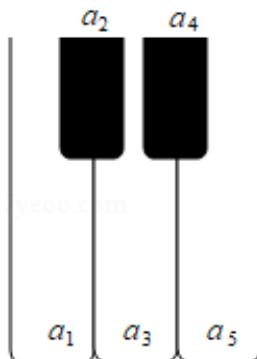
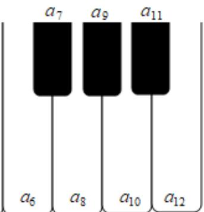

<!-- question-source:start -->
3. (5 分) 如图, 将钢琴上的 12 个键依次记为 $a_{1}, a_{2}, \cdots, a_{12}$ . 设 $1 \leq i < j < k \leq 12$ . 若 $k - j = 3$ 且 $j - i = 4$ , 则 $a_{i}, a_{j}, a_{k}$ 为原位大三和弦; 若 $k - j = 4$ 且 $j - i = 3$ , 则称 $a_{i}, a_{j}, a_{k}$ 为原位小三和弦. 用这 12 个键可以构成的原位大三和弦与原位小三和弦的个数之和为（）

A. 5 B. 8 C. 10 D. 15
<!-- question-source:end -->

![[高中/真题/按年份分类/2020/2020年全国统一高考数学试卷_文科__新课标ⅱ__含解析版_/选择题/题目/answers/Q00025052A1.md]]
