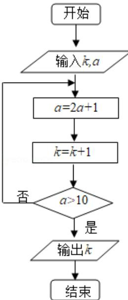

<!-- question-source:start -->
7. （5分）执行如图的程序框图，若输入的 $k = 0$ ， $a = 0$ ，则输出的 $k$ 为（）

A. 2 B. 3 C. 4 D. 5
<!-- question-source:end -->

![[高中/真题/按年份分类/2020/2020年全国统一高考数学试卷_文科__新课标ⅱ__含解析版_/选择题/题目/answers/Q00025056A1.md]]
