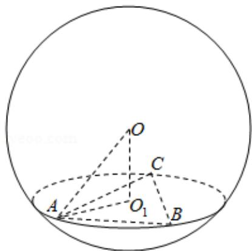

> [!faq]- 2020年全国统一高考数学试卷（文科）（新课标ⅱ）（含解析版）解析
>
> > [!success]- **【答案】** C
>
> > [!note]- **【分析】**
> > 画出图形，利用已知条件求三角形 $ABC$ 的外接圆的半径，然后求解 $OO_{1}$ 即可.
> > 【
>
> > [!note]- **【解析】**
> > 分析】画出图形，利用已知条件求三角形 $ABC$ 的外接圆的半径，然后求解 $OO_{1}$ 即可.
> > 【
> > 解答】解：由题意可知图形如图： $\triangle ABC$ 是面积为 $\frac{9\sqrt{3}}{4}$ 的等边三角形，可得 $\frac{\sqrt{3}}{4} AB^{2} = \frac{9\sqrt{3}}{4},$ $\therefore AB = BC = AC = 3,$ 可得： $AO_{1} = \frac{2}{3} \times \frac{\sqrt{3}}{2} \times 3 = \sqrt{3},$ 球 $O$ 的表面积为 $16\pi$ 外接球的半径为： $4\pi R^{2} = 16$ ，解得 $R = 2$ 所以 $O$ 到平面 $ABC$ 的距离为： $\sqrt{4 - 3} = 1.$
> >
> > 故选：C.
> >
> > 
> >
> > 【点评】本题考查球的内接体问题，求解球的半径，以及三角形的外接圆的半径是解题的关键.
