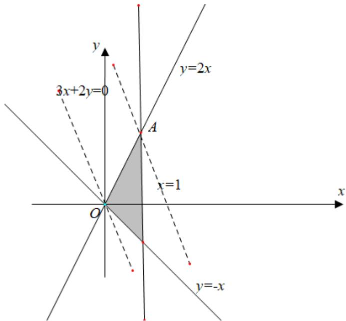

> [!faq]- 2020年全国统一高考数学试卷（文科）（新课标ⅲ）（含解析版）解析
>
> > [!success]- **【答案】** 7
>
> > [!note]- **【分析】**
> > 作出可行域，利用截距的几何意义解决.
>
> > [!note]- **【解析】**
> > 不等式组所表示的可行域如图
> >
> > 因为 $z = 3x + 2y$ ，所以 $y = -\frac{3x}{2} + \frac{z}{2}$ ，易知截距 $\frac{z}{2}$ 越大，则 z 越大，
> >
> > 平移直线 $y = -\frac{3x}{2}$ ，当 $y = -\frac{3x}{2} + \frac{z}{2}$ 经过 A 点时截距最大，此时 z 最大，
> >
> > 由 $\left\{ \begin{array}{l} y = 2x \\ x = 1 \end{array} \right.$ 得 $\left\{ \begin{array}{l} x = 1 \\ y = 2, A(1,2), \end{array} \right.$
> >
> > 所以 $z_{\mathrm{max}} = 3 \times 1 + 2 \times 2 = 7$
> >
> > 故答案为：7.
> >
> > 
> >
> > 【点睛】本题主要考查简单线性规划的应用, 涉及到求线性目标函数的最大值, 考查学生数形结合的思想, 是一道容易题.
