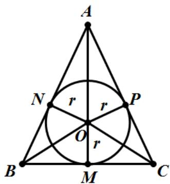

> [!faq]- 2020年全国统一高考数学试卷（文科）（新课标ⅲ）（含解析版）解析
>
> > [!success]- **【答案】** $\frac{\sqrt{2}}{3}\pi$
>
> > [!note]- **【分析】**
> > 将原问题转化为求解圆锥内切球的问题，然后结合截面确定其半径即可确定体积的值.
>
> > [!note]- **【解析】**
> > 易知半径最大球为圆锥的内切球，球与圆锥内切时的轴截面如图所示，其中 $BC = 2, AB = AC = 3$ ，且点 $M$ 为 $BC$ 边上的中点，
> >
> > 设内切圆的圆心为 $O$ ，
> >
> > 
> >
> > 由于 $AM = \sqrt{3^{2} - 1^{2}} = 2\sqrt{2}$ ，故 $S_{\triangle ABC} = \frac{1}{2} \times 2 \times 2\sqrt{2} = 2\sqrt{2}$ ，
> >
> > 设内切圆半径为 $r$ ，则：
> >
> > $$
> > S _ {\triangle A B C} = S _ {\triangle A O B} + S _ {\triangle B O C} + S _ {\triangle A O C} = \frac {1}{2} \times A B \times r + \frac {1}{2} \times B C \times r + \frac {1}{2} \times A C \times r
> > $$
> >
> > $$
> > = \frac {1}{2} \times (3 + 3 + 2) \times r = 2 \sqrt {2}
> > $$
> >
> > 解得： $r=\frac{\sqrt{2}}{2}$ ，其体积： $V=\frac{4}{3}\pi r^{3}=\frac{\sqrt{2}}{3}\pi$
> >
> > 故答案为： $\frac{\sqrt{2}}{3}\pi$
> >
> > 【点睛】与球有关的组合体问题，一种是内切，一种是外接。解题时要认真分析图形，明确切点和接点的位置，确定有关元素间的数量关系，并作出合适的截面图，如球内切于正方体，切点为正方体各个面的中心，正方体的棱长等于球的直径；球外接于正方体，正方体的顶点均在球面上，正方体的体对角线长等于球的直径。
