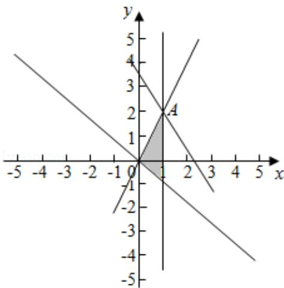

> [!faq]- 2020年全国统一高考数学试卷（文科）（新课标ⅲ）（含解析版）解析
>
> > [!success]- **【答案】** 为：7.  【点评】本题主要考查了简单的线性规划，以及利用几何意义求最值，属于基础题.
>
> > [!note]- **【分析】**
> > 先根据约束条件画出可行域，再利用几何意义求最值， $z = 3x + 2y$ 表示直线在 $y$ 轴上的截距的一半，只需求出可行域内直线在 $y$ 轴上的截距最大值即可.
>
> > [!note]- **【解析】**
> > 分析】先根据约束条件画出可行域，再利用几何意义求最值， $z = 3x + 2y$ 表示直线在 $y$ 轴上的截距的一半，只需求出可行域内直线在 $y$ 轴上的截距最大值即可.
> >
> > 【
> > 解答】解：先根据约束条件画出可行域，由 $\left\{ \begin{array}{l} x = 1 \\ 2x - y = 0 \end{array} \right.$ 解得 $A(1, 2)$ ，如图，当直线 $z = 3x + 2y$ 过点 $A(1, 2)$ 时，目标函数在 $y$ 轴上的截距取得最大值时，此时 $z$ 取得最大值，
> >
> > 即当 $x = 1, y = 2$ 时， $z_{max} = 3 \times 1 + 2 \times 2 = 7$ .
> >
> > 故
> > 答案为：7.
> >
> > 
> >
> > 【点评】本题主要考查了简单的线性规划，以及利用几何意义求最值，属于基础题.
