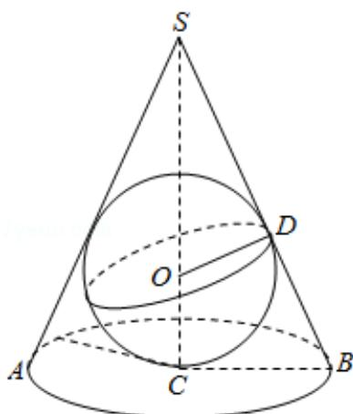

> [!faq]- 2020年全国统一高考数学试卷（文科）（新课标ⅲ）（含解析版）解析
>
> > [!success]- **【答案】** 为： $2\pi$  【点评】本题考查圆锥内切球半径求法，考查球的表面积公式，数形结合思想，属于中档题。 三、解答题：共70分。
>
> > [!note]- **【分析】**
> > 由条件易知该圆锥内半径最大的球为该圆锥的内接球，作图，数形结合即可.
> > 【
>
> > [!note]- **【解析】**
> > 分析】由条件易知该圆锥内半径最大的球为该圆锥的内接球，作图，数形结合即可.  
> > 【
> > 解答】解：当球为该圆锥内切球时，半径最大，
> >
> > 如图： $BS = 3$ ， $BC = 1$ ，则圆锥高 $SC = \sqrt{BS^2 - BC^2} = \sqrt{9 - 1} = 2\sqrt{2}$
> >
> > 设内切球与圆锥相切与点 D，半径为 r，则 $\triangle SOD \sim \triangle SCB$ ，
> >
> > 故有 $\frac{\mathrm{SO}}{\mathrm{BS}} = \frac{\mathrm{OD}}{\mathrm{BC}}$ ，即 $\frac{2\sqrt{2} - r}{3} = \frac{r}{1}$ ，解得 $r = \frac{\sqrt{2}}{2}$
> >
> > 所以该球的表面积为 $4\pi r^{2}=2\pi$ .
> >
> > 故
> > 答案为： $2\pi$
> >
> > 
> >
> > 【点评】本题考查圆锥内切球半径求法，考查球的表面积公式，数形结合思想，属于中档题。
> >
> > 三、解答题：共70分。
> > 解答应写出文字说明、证明过程或演算步骤。第17\~21题为必考题，每个试题考生都必须作答。第22、23题为选考题，考生根据要求作答。（一）必考题：共60分。
