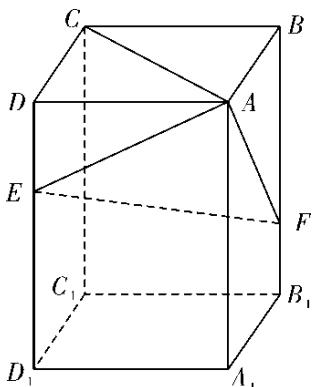

<!-- question-source:start -->
19.如图，在长方体 $ABCD - A_{1}B_{1}C_{1}D_{1}$ 中，点 $E$ ， $F$ 分别在棱 $DD_{1}$ ， $BB_{1}$ 上，且 $^{2DE = ED_{1}}$ ， $BF = 2FB_{1}$ ．证明：

(1) 当 AB = BC 时， $EF \perp AC$ ;

(2) 点 $C_{1}$ 在平面 AEF 内.

【
<!-- question-source:end -->

![[高中/真题/按年份分类/2020/2020年全国统一高考数学试卷_文科__新课标ⅲ__含解析版_/解答题/题目/answers/Q00021747A1.md]]
