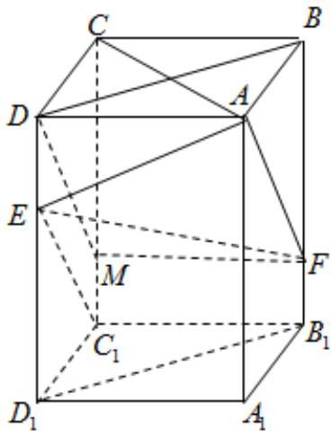

> [!faq]- 2020年全国统一高考数学试卷（文科）（新课标ⅲ）（含解析版）解析
>
> > [!success]- **【答案】** （1）证明见解析； （2）证明见解析
>
> > [!note]- **【分析】**
> > 本题未单列分析。
>
> > [!note]- **【解析】**
> > 
> > (1) 因为长方体 $ABCD - A_{1}B_{1}C_{1}D_{1}$ ，所以 $BB_{1} \perp$ 平面 $ABCD \therefore AC \perp BB_{1}$
> >
> > 因为长方体 $ABCD - A_{1}B_{1}C_{1}D_{1}, AB = BC$ ，所以四边形 ABCD 为正方形 $\therefore AC \perp BD$
> >
> > 因为 $BB_{1}$ I BD = B, $BB_{1}$ 、 $BD \subset$ 平面 $BB_{1}D_{1}D$ ，因此 $AC \perp$ 平面 $BB_{1}D_{1}D$ ，
> >
> > 因为 $EF \subset$ 平面 $BB_{1}D_{1}D$ ，所以 $AC \perp EF$ ；
