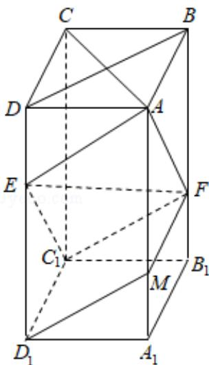

> [!faq]- 2020年全国统一高考数学试卷（文科）（新课标ⅲ）（含解析版）解析
>
> > [!success]- **【答案】** 详见解析
>
> > [!note]- **【分析】**
> > （1）因为 $ABCD - A_{1}B_{1}C_{1}D_{1}$ 是长方体，且 AB = BC，可得 $AC \perp$ 平面 $BB_{1}D_{1}D$ ，因为 $EF \subset$ 平面 $BB_{1}D_{1}D$ ，所以 $EF \perp AC$ .
>
> > [!note]- **【解析】**
> > 分析】（1）因为 $ABCD - A_{1}B_{1}C_{1}D_{1}$ 是长方体，且 AB = BC，可得 $AC \perp$ 平面 $BB_{1}D_{1}D$ ，因为 $EF \subset$ 平面 $BB_{1}D_{1}D$ ，所以 $EF \perp AC$ .
> >
> > (2) 取 $AA_{1}$ 上靠近 $A_{1}$ 的三等分点 $M$ ，连接 $DM$ ， $C_{1}F$ ， $MF$ 。根据已知条件可得四边形 $AED_{1}M$ 为平行四边形，得 $D_{1}M \|AE$ ，再推得四边形 $C_{1}D_{1}MF$ 为平行四边形，所以 $D_{1}M \|C_{1}F$ ，根据直线平行的性质可得 $AE \|C_{1}F$ ，所以 $A, E, F, C_{1}$ 四点共面，即点 $C_{1}$ 在平面 $AEF$ 内。
> >
> > 【
> > 解答】解：（1）因为 $ABCD - A_{1}B_{1}C_{1}D_{1}$ 是长方体，所以 $BB_{1} \perp$ 平面 ABCD，而 $AC \subset$ 平面 ABCD，所以 $AC \perp BB_{1}$ ，
> > 因为 $ABCD-A_{1}B_{1}C_{1}D_{1}$ 是长方体，且 AB=BC，所以 ABCD 是正方形，所以 $AC \perp BD$ ，又 $BD \cap BB_{1} = B$ .
> > 所以 $AC \perp$ 平面 $BB_{1}D_{1}D$ ，又因为点 E，F 分别在棱 $DD_{1}$ ， $BB_{1}$ 上，所以 $EF \subset$ 平面 $BB_{1}D_{1}D$ ，所以 $EF \perp AC$ .
> >
> > (2) 取 $AA_{1}$ 上靠近 $A_{1}$ 的三等分点 M，连接 $D_{1}M$ ， $C_{1}F$ ，MF.
> >
> > 因为点 E 在 $DD_{1}$ ，且 $2DE = ED_{1}$ ，所以 $ED \parallel AM$ ，且 ED = AM，
> >
> > 所以四边形 $AED_{1}M$ 为平行四边形，所以 $D_{1}M\|AE$ ，且 $D_{1}M=AE$ ，
> >
> > 又因为 F 在 $BB_{1}$ 上，且 $BF=2FB_{1}$ ，所以 $A_{1}M\|FB_{1}$ ，且 $A_{1}M=FB_{1}$ ，
> >
> > 所以 $A_{1}B_{1}FM$ 为平行四边形，
> >
> > 所以 $FM\|A_{1}B_{1}, FM=A_{1}B_{1}$ ，即 $FM\|C_{1}D_{1}, FM=C_{1}D_{1}$ ，
> >
> > 所以 $C_{1}D_{1}MF$ 为平行四边形，
> >
> > 所以 $D_{1}M\| C_{1}F$
> >
> > 所以 $AE\| C_1F$ ，所以 $A,E,F,C_1$ 四点共面.
> >
> > 所以点 $C_{1}$ 在平面 AEF 内.
> >
> > 
> >
> > 【点评】本题考查直线与平面垂直的判定，考查直线平行的性质应用，是中档题.
