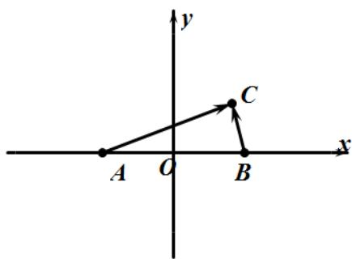

> [!faq]- 2020年全国统一高考数学试卷（文科）（新课标ⅲ）（含解析版）解析
>
> > [!success]- **【答案】** A
>
> > [!note]- **【分析】**
> > 首先建立平面直角坐标系，然后结合数量积的定义求解其轨迹方程即可.
>
> > [!note]- **【解析】**
> > 设 $AB = 2a (a > 0)$ ，以 AB 中点为坐标原点建立如图所示的平面直角坐标系，
> >
> > 
> >
> > 则： $A(-a,0), B(a,0)$ ，设 $C(x,y)$ ，可得： $\overrightarrow{AC}=(x+a,y), \overrightarrow{BC}=(x-a,y)$ ,
> >
> > 从而： $AC \cdot BC = (x + a)(x - a) + y^{2}$ ,
> >
> > 结合题意可得： $(x+a)(x-a)+y^{2}=1$
> >
> > 整理可得： $x^{2} + y^{2} = a^{2} + 1$
> >
> > 即点 C 的轨迹是以 AB 中点为圆心， $\sqrt{a^{2}+1}$ 为半径的圆.
> >
> > 故选：A.
> >
> > 【点睛】本题主要考查平面向量及其数量积的坐标运算, 轨迹方程的求解等知识, 意在考查学生
> >
> > 的转化能力和计算求解能力.
