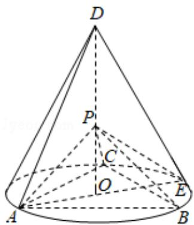

<!-- question-source:start -->
18. (12 分) 如图, $D$ 为圆锥的顶点, $O$ 是圆锥底面的圆心, $AE$ 为底面直径, $AE = AD$ . $\triangle ABC$ 是底面的内接正三角形, $P$ 为 $DO$ 上一点, $PO = \frac{\sqrt{6}}{6} DO$ .

(1) 证明: $PA \perp$ 平面 $PBC$ ;

(2) 求二面角 B - PC - E 的余弦值.

<!-- question-source:end -->

![[高中/真题/按年份分类/2020/2020年全国统一高考数学试卷_理科__新课标ⅰ__含解析版_/解答题/题目/answers/Q00024376A1.md]]
