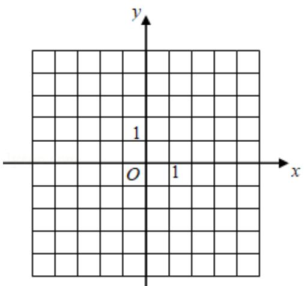

<!-- question-source:start -->
23. 已知函数 $f(x) = |3x + 1| - 2|x - 1|$ .

(1) 画出 $y = f(x)$ 的图象；

(2) 求不等式 $f(x) > f(x + 1)$ 的解集.

# 2020 年全国统一高考数学试卷（理科）（新课标 I）

参考答案与试题解析

##
一、选择题: 本题共 12 小题, 每小题 5 分, 共 60 分。在每小题给出的四个选项中, 只有一项是符合题目要求的。
<!-- question-source:end -->

![[高中/真题/按年份分类/2020/2020年全国统一高考数学试卷_理科__新课标ⅰ__含解析版_/解答题/题目/answers/Q00030697A1.md]]
