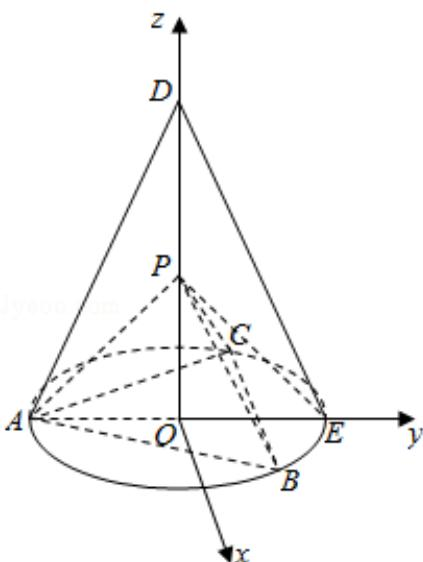

> [!faq]- 2020年全国统一高考数学试卷（理科）（新课标ⅰ）（含解析版）解析
>
> > [!success]- **【答案】** 详见解析
>
> > [!note]- **【分析】**
> > （1）设圆 O 的半径为 1，求出各线段的长度，利用勾股定理即可得到 $PA \perp PC$ ， $PA \perp PB$ ，进而得证；
>
> > [!note]- **【解析】**
> > 分析】（1）设圆 O 的半径为 1，求出各线段的长度，利用勾股定理即可得到 $PA \perp PC$ ， $PA \perp PB$ ，进而得证；
> >
> > (2) 建立空间直角坐标系，求出平面 $PBC$ 及平面 $PCE$ 的法向量，利用向量的夹角公式即可得解.
> >
> > 【
> > 解答】解：(1) 不妨设圆 O 的半径为 1, OA = OB = OC = 1, AE = AD = 2, AB = BC = AC = $\sqrt{3}$ , $DO=\sqrt{DA^{2}-OA^{2}}=\sqrt{3},\quad PO=\frac{\sqrt{6}}{6}DO=\frac{\sqrt{2}}{2},$ PA=PB=PC= $\sqrt{PO^{2}+AO^{2}}=\frac{\sqrt{6}}{2}$ ,
> > 在 $\triangle PAC$ 中， $PA^{2}+PC^{2}=AC^{2}$ ，故 $PA\perp PC$ ，
> >
> > 同理可得 $PA \perp PB$ ，又 $PB \cap PC = P$ ，
> >
> > 故 $PA \perp$ 平面 PBC;
> >
> > （2）建立如图所示的空间直角坐标系，则有
> >
> > $\mathrm{B}(\frac{\sqrt{3}}{2}, \frac{1}{2}, 0), \mathrm{C}(\frac{\sqrt{3}}{2}, \frac{1}{2}, 0), \mathrm{P}(0, 0, \frac{\sqrt{2}}{2}), E(0, 1, 0)$
> >
> > 故 $\overrightarrow{\mathrm{BC}} = (-\sqrt{3}, 0, 0)$ ， $\overrightarrow{\mathrm{CE}} = (\frac{\sqrt{3}}{2}, \frac{1}{2}, 0)$ ， $\overrightarrow{\mathrm{CP}} = (\frac{\sqrt{3}}{2}, -\frac{1}{2}, \frac{\sqrt{2}}{2})$
> >
> > 设平面 $PBC$ 的法向量为 $\vec{\mathrm{m}} = (\mathbf{x},\mathbf{y},\mathbf{z})$ ，则 $\left\{ \begin{array}{l}\overrightarrow{\mathrm{m}}\cdot \overrightarrow{\mathrm{BC}} = -\sqrt{3}\mathrm{x} = 0\\ \overrightarrow{\mathrm{m}}\cdot \overrightarrow{\mathrm{CP}} = \frac{\sqrt{3}}{2}\mathrm{x} - \frac{1}{2}\mathrm{y} + \frac{\sqrt{2}}{2}\mathrm{z} = 0 \end{array} \right.$ ，可取
> >
> > $$
> > \vec {\mathrm{m}} = (0, \sqrt {2}, 1) ^ {\prime}
> > $$
> >
> > 同理可求得平面 $PCE$ 的法向量为 $\vec{n} = (\sqrt{2}, -\sqrt{6}, -2\sqrt{3})$
> >
> > 故 $\cos \theta = \frac{|\vec{\mathbf{m}}\cdot\vec{\mathbf{n}}|}{|\vec{\mathbf{m}}||\vec{\mathbf{n}}|} = \frac{2\sqrt{5}}{5}$ ，即二面角 $B - PC - E$ 的余弦值为 $\frac{2\sqrt{5}}{5}$
> >
> > 
> >
> > 【点评】本题考查线面垂直的判定以及利用空间向量求解二面角，考查推理能力及计算能力，属于基础题.
