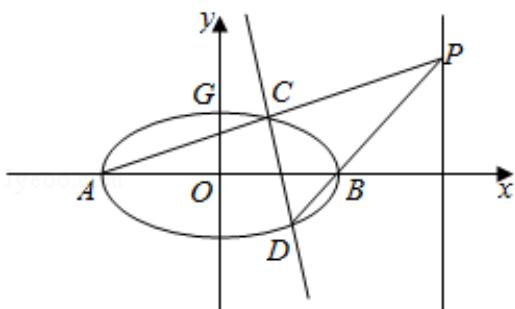

> [!faq]- 2020年全国统一高考数学试卷（理科）（新课标ⅰ）（含解析版）解析
>
> > [!success]- **【答案】** 个不同的温度条件下进行种子发芽实验, 由实验数据 $(x_i, y_i)$ ( $i=1,2,\cdots,20$ ) 得到下
>
> > [!note]- **【分析】**
> > （1）求出 $\overrightarrow{AG} \cdot \overrightarrow{GB} = a^2 - 1 = 8$ ，解出 $a$ ，求出 $E$ 的方程即可；
> > (2) 联立直线和椭圆的方程求出 $C, D$ 的坐标，求出直线 $CD$ 的方程，判断即可.
>
> > [!note]- **【解析】**
> > 解：如图示：
> >
> > 
> > (1) 由题意 $A(-a, 0)$ , $B(a, 0)$ , $G(0, 1)$ ,
> >
> > $\therefore \overrightarrow{\mathrm{AG}} = (a, 1)$ ， $\overrightarrow{\mathrm{GB}} = (a, -1)$ ， $\overrightarrow{\mathrm{AG}} \cdot \overrightarrow{\mathrm{GB}} = a^2 - 1 = 8$ ，解得： $a = 3$
> >
> > 故椭圆 E 的方程是 $\frac{x^{2}}{9} + y^{2} = 1$ ;
> > (2) 由
> > (1) 知 $A(-3,0)$ , $B(3,0)$ , 设 $P(6,m)$ ,
> >
> > 则直线 $PA$ 的方程是 $y = \frac{\pi}{9} (x + 3)$ ，
> >
> > 联立 $\left\{ \begin{array}{l} \frac{\mathbf{x}^2}{9} + \mathbf{y}^2 = 1 \\ \mathbf{y} = \frac{\pi}{9} (\mathbf{x} + 3) \end{array} \right. \Rightarrow (9 + m^2)x^2 + 6m^2x + 9m^2 - 81 = 0,$
> >
> > 由韦达定理 $-3x_{c} = \frac{9m^{2} - 81}{9 + m^{2}}\Rightarrow x_{c} = \frac{-3m^{2} + 27}{9 + m^{2}},$
> >
> > 代入直线 $PA$ 的方程为 $y = \frac{\pi}{9} (x + 3)$ 得：
> >
> > $y_{c}=\frac{6m}{9+m^{2}}$ ，即 $C\left(\frac{-3m^{2}+27}{9+m^{2}},\frac{6m}{9+m^{2}}\right)$ ，
> >
> > 直线 $PB$ 的方程是 $y = \frac{\mathfrak{m}}{3} (x - 3)$ ，
> >
> > 联立方程 $\left\{ \begin{array}{l} \frac{x^2}{9} + y^2 = 1 \\ y = \frac{m}{3}(x - 3) \end{array} \right. \Rightarrow (1 + m^2)x^2 - 6m^2x + 9m^2 - 9 = 0,$
> >
> > 由韦达定理 $3x_{D} = \frac{9\mathrm{m}^{2} - 9}{1 + \mathrm{m}^{2}}\Rightarrow x_{D} = \frac{3\mathrm{m}^{2} - 3}{1 + \mathrm{m}^{2}},$
> >
> > 代入直线 $PB$ 的方程为 $y = \frac{\mathrm{m}}{3} (x - 3)$ 得 $y_{D} = \frac{-2\mathrm{m}}{1 + \mathrm{m}^{2}}$
> >
> > 即 $D$ （ $\frac{3\mathrm{m}^2 - 3}{1 + \mathrm{m}^2},\frac{-2\mathrm{m}}{1 + \mathrm{m}^2}$ ）
> >
> > ∴直线 CD 的斜率 $K_{CD}=\frac{y_{C}-y_{D}}{x_{C}-x_{D}}=\frac{4m}{3(3-m^{2})}$ ,
> >
> > ∴直线 CD 的方程是 $y - \frac{-2m}{1 + m^{2}} = \frac{4m}{3(3 - m^{2})} \left(x - \frac{3m^{2} - 3}{1 + m^{2}}\right)$ ，整理得：
> >
> > $$
> > y = \frac {4 m}{3 (3 - m ^ {2})} (x - \frac {3}{2})
> > $$
> >
> > 故直线 $CD$ 过定点 $\left(\frac{3}{2}, 0\right)$ .
