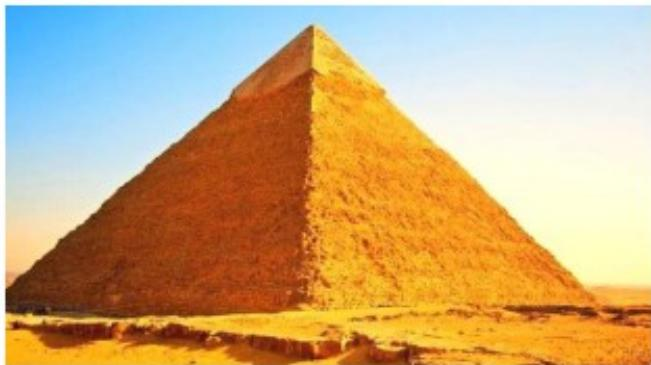

<!-- question-source:start -->
3. (5 分) 埃及胡夫金字塔是古代世界建筑奇迹之一, 它的形状可视为一个正四棱锥. 以该四棱锥的高为边长的正方形面积等于该四棱锥一个侧面三角形的面积, 则其侧面三角形底边上的高与底面正方形的边长的比值为 ( )

A. $\frac{\sqrt{5} - 1}{4}$ B. $\frac{\sqrt{5} - 1}{2}$ C. $\frac{\sqrt{5} + 1}{4}$ D. $\frac{\sqrt{5} + 1}{2}$
<!-- question-source:end -->

![[高中/真题/按年份分类/2020/2020年全国统一高考数学试卷_理科__新课标ⅰ__含解析版_/选择题/题目/answers/Q00024361A1.md]]
