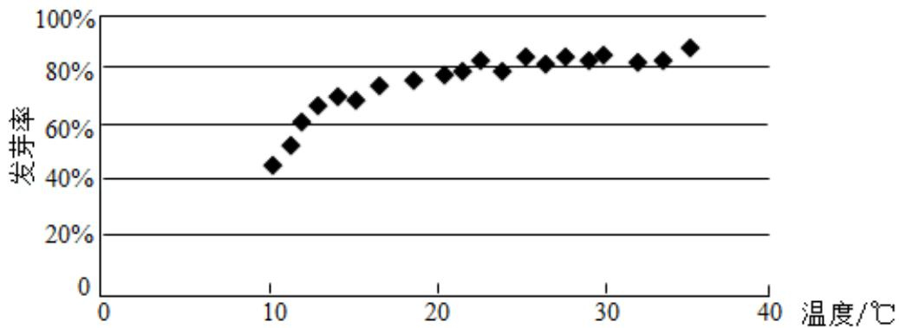

<!-- question-source:start -->
5. (5 分) 某校一个课外学习小组为研究某作物种子的发芽率 $y$ 和温度 $x$ (单位: $^\circ \mathrm{C}$ ) 的关系, 在 20 个不同的温度条件下进行种子发芽实验, 由实验数据 $(x_i, y_i)$ ( $i=1,2,\cdots,20$ ) 得到下面的散点图:

由此散点图, 在 $10^{\circ} \mathrm{C}$ 至 $40^{\circ} \mathrm{C}$ 之间, 下面四个回归方程类型中最适宜作为发芽率 $y$ 和温度 $x$ 的回归方程类型的是 ( ) A. $y = a + bx$ B. $y = a + bx^{2}$ C. $y = a + be^{x}$ D. $y = a + b \ln x$
<!-- question-source:end -->

![[高中/真题/按年份分类/2020/2020年全国统一高考数学试卷_理科__新课标ⅰ__含解析版_/选择题/题目/answers/Q00024363A1.md]]
