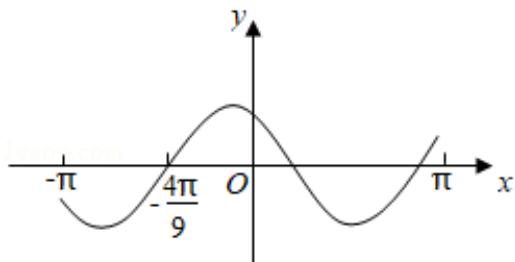

<!-- question-source:start -->
7. (5 分) 设函数 $f(x) = \cos \left( \omega x + \frac{\pi}{6} \right)$ 在 $[- \pi, \pi]$ 的图象大致如图，则 $f(x)$ 的最小正周期为（）

A. $\frac{10\pi}{9}$ B. $\frac{7\pi}{6}$ C. $\frac{4\pi}{3}$ D. $\frac{3\pi}{2}$
<!-- question-source:end -->

![[高中/真题/按年份分类/2020/2020年全国统一高考数学试卷_理科__新课标ⅰ__含解析版_/选择题/题目/answers/Q00024365A1.md]]
