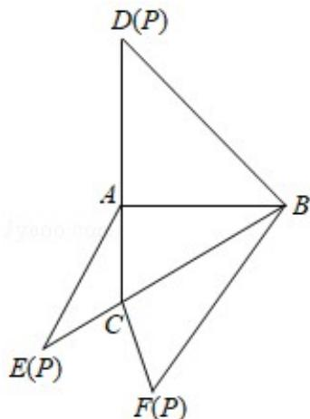

<!-- question-source:start -->
16．（5分）如图，在三棱锥 P-ABC 的平面展开图中，AC=1， $AB=AD=\sqrt{3}$ ， $AB\perp AC$ ， $AB\perp AD$ ， $\angle CAE=30^{\circ}$ ，则 $\cos\angle FCB=$ \_\_\_\_.

##
<!-- question-source:end -->

![[高中/真题/按年份分类/2020/2020年全国统一高考数学试卷_理科__新课标ⅰ__含解析版_/选择题/题目/answers/Q00029097A1.md]]
