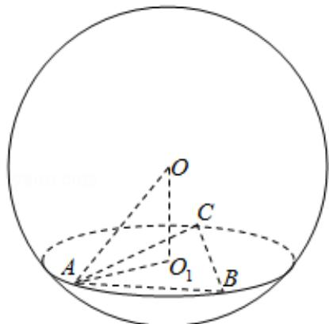

> [!faq]- 2020年全国统一高考数学试卷（理科）（新课标ⅰ）（含解析版）解析
>
> > [!success]- **【答案】** A
>
> > [!note]- **【分析】**
> > 画出图形，利用已知条件求出 $OO_{1}$ ，然后求解球的半径，即可求解球的表面积.
>
> > [!note]- **【解析】**
> > 分析】画出图形，利用已知条件求出 $OO_{1}$ ，然后求解球的半径，即可求解球的表面积.
> >
> > 【
> > 解答】解：由题意可知图形如图： $\odot O_{1}$ 的面积为 $4 \pi$ ，可得 $O_{1} A = 2$ ，则
> >
> > $$
> > \frac {3}{2} A O _ {1} = A B \sin 6 0 ^ {\circ}, \frac {3}{2} A O _ {1} = \frac {\sqrt {3}}{2} A B
> > $$
> >
> > $$
> > \therefore A B = B C = A C = O O _ {1} = 2 \sqrt {3},
> > $$
> >
> > 外接球的半径为： $R = \sqrt{\mathrm{AO}_1^2 + \mathrm{OO}_1^2} = 4,$
> >
> > 球 O 的表面积： $4 \times \pi \times 4^{2} = 64\pi$ .
> >
> > 故选：A.
> >
> > 
> >
> > 【点评】本题考查球的内接体问题，球的表面积的求法，求解球的半径是解题的关键.
