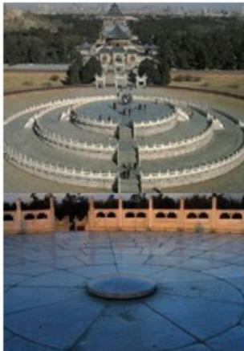
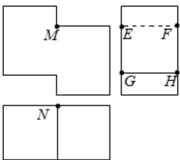

# 2020 年全国统一高考数学试卷（理科）（新课标Ⅱ）

##
一、选择题: 本题共 12 小题, 每小题 5 分, 共 60 分。在每小题给出的四个选项中, 只有一项是符合题目要求的。

1. (5分) 已知集合 $U = \{-2, -1, 0, 1, 2, 3\}, A = \{-1, 0, 1\}, B = \{1, 2\}$ , 则 $\mathsf{C}_{\mathbb{U}}(A \cup B) = (\quad)$ A. $\{-2, 3\}$ B. $\{-2, 2, 3\}$ C. $\{-2, -1, 0, 3\}$ D. $\{-2, -1, 0, 2, 3\}$

2. (5分) 若 $\alpha$ 为第四象限角, 则 ( )
A. $\cos 2\alpha > 0$ B. $\cos 2\alpha < 0$ C. $\sin 2\alpha > 0$ D. $\sin 2\alpha < 0$

3. (5 分) 在新冠肺炎疫情防控期间, 某超市开通网上销售业务, 每天能完成 1200 份订单的配货, 由于订单量大幅增加, 导致订单积压。为解决困难, 许多志愿者踊跃报名参加配货工作。已知该超市某日积压 500 份订单未配货, 预计第二天的新订单超过 1600 份的概率为 0.05。志愿者每人每天能完成 50 份订单的配货, 为使第二天完成积压订单及当日订单的配货的概率不小于 0.95, 则至少需要志愿者 ( )

A. 10 名    B. 18 名    C. 24 名    D. 32 名

4. (5 分) 北京天坛的圜丘坛为古代祭天的场所, 分上、中、下三层. 上层中心有一块圆形石板 (称为天心石), 环绕天心石砌 9 块扇面形石板构成第一环, 向外每环依次增加 9 块. 下一层的第一环比上一层的最后一环多 9 块, 向外每环依次也增加 9 块. 已知每层环数相同, 且下层比中层多 729 块, 则三层共有扇面形石板 (不含天心石) ( )

A. 3699块 B. 3474块 C. 3402块 D. 3339块

5. (5 分) 若过点 (2, 1) 的圆与两坐标轴都相切, 则圆心到直线 $2x - y - 3 = 0$ 的距离为 ( )

A. $\frac{\sqrt{5}}{5}$ B. $\frac{2\sqrt{5}}{5}$ C. $\frac{3\sqrt{5}}{5}$ D. $\frac{4\sqrt{5}}{5}$

6. （5分）数列 $\{a_{n}\}$ 中， $a_{1} = 2$ ， $a_{m + n} = a_{m}a_{n}$ . 若 $a_{k + 1} + a_{k + 2} + \ldots + a_{k + 10} = 2^{15} - 2^{5}$ ，则 $k = (\quad)$ A. 2 B. 3 C. 4 D. 5

7. (5 分) 如图是一个多面体的三视图, 这个多面体某条棱的一个端点在正视图中对应的点为 $M$ , 在俯视图中对应的点为 $N$ , 则该端点在侧视图中对应的点为 ( )

A. $E$ B. $F$ C. $G$ D. $H$

8. (5分) 设 $O$ 为坐标原点, 直线 $x = a$ 与双曲线 $C: \frac{x^2}{a^2} - \frac{y^2}{b^2} = 1 (a > 0, b > 0)$ 的两条渐近线分别交于 $D$ , $E$ 两点. 若 $\triangle ODE$ 的面积为 8 , 则 $C$ 的焦距的最小值为 ( )

A. 4 B. 8 C. 16 D. 32

9. （5分）设函数 $f(x) = \ln |2x + 1| - \ln |2x - 1|$ ，则 $f(x)$ （）
A. 是偶函数，且在 $(\frac{1}{2}, +\infty)$ 单调递增
B. 是奇函数，且在 $(- \frac{1}{2}, \frac{1}{2})$ 单调递减
C. 是偶函数，且在 $(-\infty, -\frac{1}{2})$ 单调递增
D. 是奇函数，且在 $(-\infty, -\frac{1}{2})$ 单调递减

10. (5分) 已知 $\triangle ABC$ 是面积为 $\frac{9\sqrt{3}}{4}$ 的等边三角形, 且其顶点都在球 $O$ 的球面上. 若球 $O$ 的表面积为 $16\pi$ , 则 $O$ 到平面 $ABC$ 的距离为 ( )

A. $\sqrt{3}$ B. $\frac{3}{2}$ C. 1

D. $\frac{\sqrt{3}}{2}$

11.（5分）若 $2^{x} - 2^{y} < 3^{-x} - 3^{-y}$ ，则（）
A. $\ln (y - x + 1) > 0$ B. $\ln (y - x + 1) < 0$ C. $\ln |x - y| > 0$ D. $\ln |x - y| < 0$

12. (5分) 0 - 1 周期序列在通信技术中有着重要应用. 若序列 $a_1 a_2 \ldots a_n \ldots$ 满足 $a_i \in \{0, 1\}$ ( $i = 1, 2, \cdots$ ), 且存在正整数 $m$ , 使得 $a_{i+m} = a_i$ ( $i = 1, 2, \cdots$ ) 成立, 则称其为 0 - 1 周期序列, 并称满足 $a_{i+m} = a_i$ ( $i = 1, 2 \ldots$ ) 的最小正整数 $m$ 为这个序列的周期. 对于周期为 $m$ 的 0 - 1 序列 $a_1 a_2 \ldots a_n \ldots$ , $C(k) = \frac{1}{m} \sum_{i=1}^{m} a_i a_{i+k}$ ( $k = 1, 2, \cdots, m-1$ ) 是描述其性质的重要指标, 下列周期为 5 的 0 - 1 序列中, 满足 $C(k) \leqslant \frac{1}{5}$ ( $k = 1, 2, 3, 4$ ) 的序列是 ( )

A. 11010... B. 11011... C. 10001... D. 11001...

##

![[高中/真题/按年份分类/2020/2020年全国统一高考数学试卷_理科__新课标ⅱ__含解析版_/填空题/填空题.md]]
![[高中/真题/按年份分类/2020/2020年全国统一高考数学试卷_理科__新课标ⅱ__含解析版_/选择题/选择题.md]]
![[高中/真题/按年份分类/2020/2020年全国统一高考数学试卷_理科__新课标ⅱ__含解析版_/解答题/解答题.md]]
