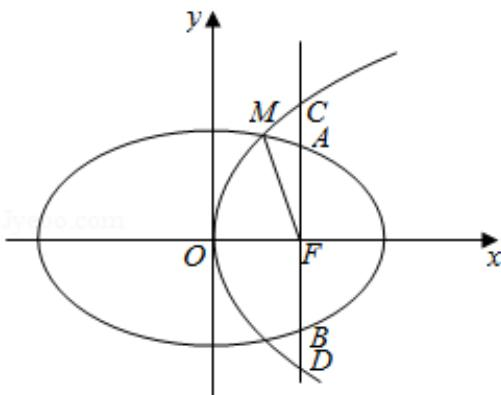

> [!faq]- 2020年全国统一高考数学试卷（理科）（新课标ⅱ）（含解析版）解析
>
> > [!success]- **【答案】** （12分）已知椭圆 $C_1: \frac{x^2}{a^2} + \frac{y^2}{b^2} =
>
> > [!note]- **【分析】**
> > （1）由 F 为 $C_{1}$ 的焦点且 $AB \perp x$ 轴，F 为 $C_{2}$ 的焦点且 $CD \perp x$ 轴，分别求得 F 的坐标和 $|AB|, |CD|$ ，由已知条件可得 p, c, a, b 的方程，消去 p，结合 a, b, c 和 e 的关系，解方程可得 e 的值；
> > (2) 由
> > (1) 用 $c$ 表示椭圆方程和抛物线方程, 联立两曲线方程, 解得 $M$ 的横坐标, 再由抛物线的定义, 解方程可得 $c$ , 进而得到所求曲线方程.
>
> > [!note]- **【解析】**
> > 解：
> > （1）因为 F 为 $C_{1}$ 的焦点且 $AB \perp x$ 轴，
> >
> > 可得 $F(c,0)$ ， $\vert AB\vert = \frac{2b^2}{a}$
> >
> > 设 $C_{2}$ 的标准方程为 $y^{2}=2px\quad(p>0)$ ，
> >
> > 因为 $F$ 为 $C_2$ 的焦点且 $CD \perp x$ 轴，所以 $F\left(\frac{p}{2}, 0\right)$ ， $|CD| = 2p$
> >
> > 因为 $|CD|=\frac{4}{3}|AB|$ ， $C_{1}$ ， $C_{2}$ 的焦点重合，所以 $\left\{\begin{aligned}&c=\frac{p}{2}\\ &2p=\frac{4}{3}\cdot\frac{2b^{2}}{a}\end{aligned}\right.$
> >
> > 消去 $p$ ，可得 $4c = \frac{8b^2}{3a}$ ，所以 $3ac = 2b^{2}$
> >
> > 所以 $3ac=2a^{2}-2c^{2}$ ,
> >
> > 设 $C_1$ 的离心率为 $e$ ，由 $e = \frac{c}{a}$ ，则 $2e^2 + 3e - 2 = 0$
> >
> > 解得 $e = \frac{1}{2}$ （-2舍去），故 $C_1$ 的离心率为 $\frac{1}{2}$
> > (2) 由
> > (1) 可得 $a = 2c, b = \sqrt{3} c, p = 2c$
> >
> > 所以 $C_1: \frac{x^2}{4c^2} + \frac{y^2}{3c^2} = 1, C_2: y^2 = 4cx,$
> >
> > 联立两曲线方程，消去 y，可得 $3x^{2}+16cx-12c^{2}=0$ ，
> >
> > 所以 $(3x - 2c)$ （ $x + 6c$ ） $= 0$ ，解得 $x = \frac{2}{3} c$ 或 $x = -6c$ （舍去），
> >
> > 从而 $|MF|=x+\frac{p}{2}=\frac{2}{3}c+c=\frac{5}{3}c=5,$
> >
> > 解得 c=3，
> >
> > 所以 $C_1$ 和 $C_2$ 的标准方程分别为 $\frac{x^2}{36} +\frac{y^2}{27} = 1$ ， $y^{2} = 12x$
> >
> > 
