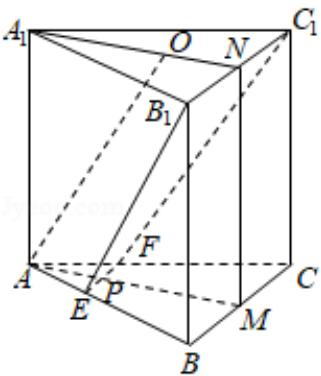

> [!faq]- 2020年全国统一高考数学试卷（理科）（新课标ⅱ）（含解析版）解析
>
> > [!success]- **【答案】** 0 个地块, 从这些地块中用简单随机抽样的方法抽取
>
> > [!note]- **【分析】**
> > （1）推导出 $B_{1}N = BM$ ，四边形 $BB_{1}NM$ 为矩形， $A_{1}N \perp B_{1}C_{1}$ ，从而 $BB_{1}\| MN$ ，由此能证明 $AA_{1}\| MN$ ，且平面 $A_{1}AMN \perp$ 平面 $EB_{1}C_{1}F$ 。
> > (2) 推导出 $EF\| B_1C_1\| BC$ ，从而 $AO\| PN$ ，四边形 $APNO$ 为平行四边形， $A_1N = 3ON$ ， $AM = 3AP$ ， $PN = BC = B_1C_1 = 3EF$ ，直线 $B_1E$ 在平面 $A_1AMN$ 内的投影为 $PN$ ，从而直线 $B_1E$ 与平面 $A_{1}AMN$ 所成角即为等腰梯形 $EFC_{1}B_{1}$ 中 $B_{1}E$ 与 $PN$ 所成角，由此能求出直线 $B_{1}E$ 与平面 $A_{1}AMN$ 所成角的正弦值.
>
> > [!note]- **【解析】**
> > 解：
> > （1）证明：∵M，N分别为BC， $B_{1}C_{1}$ 的中点，底面为正三角形，
> >
> > $\therefore B_{1}N = BM$ ，四边形 $BB_{1}NM$ 为矩形， $A_{1}N\bot B_{1}C_{1}$
> >
> > $$
> > \therefore B B _ {1} \| M N, \because A A _ {1} \| B B _ {1}, \therefore A A _ {1} \| M N,
> > $$
> >
> > $$
> > \because M N \perp B _ {1} C _ {1}, A _ {1} N \perp B _ {1} C _ {1}, M N \cap A _ {1} N = N,
> > $$
> >
> > $\therefore B_{1}C_{1}\perp$ 平面 $A_{1}AMN$ ,
> >
> > $\because B_{1}C_{1}\subset$ 平面 $EB_{1}C_{1}F,$
> >
> > ∴平面 $A_{1}AMN \perp$ 平面 $EB_{1}C_{1}F$ ,
> >
> > 综上， $AA_{1}\|MN$ ，且平面 $A_{1}AMN\perp$ 平面 $EB_{1}C_{1}F$ .
> > (2) 解：∵三棱柱上下底面平行，平面 $EB_{1}C_{1}F$ 与上下底面分别交于 $B_{1}C_{1}$ ，EF，
> > ∴EF∥B₁C₁∥BC,
> >
> > ∵AO∥面 $EB_{1}C_{1}F$ ，AO⊂面 $AMNA_{1}$ ，面 $AMNA_{1}\cap$ 面 $EB_{1}C_{1}F=PN$ ，
> >
> > $\therefore AO \parallel PN$ ，四边形 $APNO$ 为平行四边形，
> >
> > ∵O 是正三角形的中心，AO=AB，
> >
> > $$
> > \therefore A _ {1} N = 3 O N, A M = 3 A P, P N = B C = B _ {1} C _ {1} = 3 A P = 3 E F,
> > $$
> >
> > 由
> > （1）知直线 $B_{1}E$ 在平面 $A_{1}AMN$ 内的投影为 PN，
> >
> > 直线 $B_{1}E$ 与平面 $A_{1}AMN$ 所成角即为等腰梯形 $EFC_{1}B_{1}$ 中 $B_{1}E$ 与 PN 所成角，
> >
> > 在等腰梯形 $EFC_{1}B_{1}$ 中，令 EF=1，过 E 作 $EH\perp B_{1}C_{1}$ 于 H，
> >
> > 则 $PN=B_{1}C_{1}=EH=3,\ B_{1}H=1,\ B_{1}E=\sqrt{10},$
> >
> > $$
> > \sin \angle B _ {1} E H = \frac {\mathrm{B} _ {1} \mathrm{H}}{\mathrm{B} _ {1} \mathrm{E}} = \frac {\sqrt {1 0}}{1 0},
> > $$
> >
> > ∴直线 $B_{1}E$ 与平面 $A_{1}AMN$ 所成角的正弦值为 $\frac{\sqrt{10}}{10}$ .
> >
> > 
