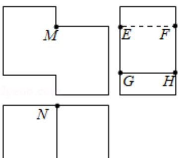

<!-- question-source:start -->
7. (5 分) 如图是一个多面体的三视图, 这个多面体某条棱的一个端点在正视图中对应的点为 $M$ , 在俯视图中对应的点为 $N$ , 则该端点在侧视图中对应的点为 ( )

A. $E$ B. $F$ C. $G$ D. $H$
<!-- question-source:end -->

![[高中/真题/按年份分类/2020/2020年全国统一高考数学试卷_理科__新课标ⅱ__含解析版_/选择题/题目/answers/Q00030818A1.md]]
