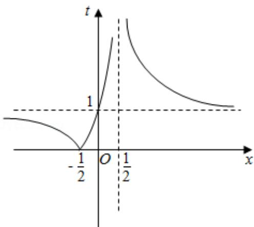

> [!faq]- 2020年全国统一高考数学试卷（理科）（新课标ⅱ）（含解析版）解析
>
> > [!success]- **【答案】** D
>
> > [!note]- **【分析】**
> > 求出 $x$ 的取值范围，由定义判断为奇函数，利用对数的运算性质变形，再判断内层函数 $t = \left|\frac{2x + 1}{2x - 1}\right|$ 的单调性，由复合函数的单调性得
>
> > [!note]- **【解析】**
> > 分析】求出 $x$ 的取值范围，由定义判断为奇函数，利用对数的运算性质变形，再判断内层函数 $t = \left|\frac{2x + 1}{2x - 1}\right|$ 的单调性，由复合函数的单调性得
> > 答案.
> >
> > 【
> > 解答】解：由 $\left\{\begin{aligned}&2x+1\neq0\\ &2x-1\neq0\end{aligned}\right.$ ，得 $x\neq\pm\frac{1}{2}$ .
> >
> > 又 $f(-x) = ln| - 2x + 1| - ln| - 2x - 1| = - (ln|2x + 1| - ln|2x - 1|) = -f(x)$
> >
> > $\therefore f(x)$ 为奇函数；
> >
> > $$
> > f (x) = l n | 2 x + 1 | - l n | 2 x - 1 | = 1 \mathrm{n} \frac {| 2 \mathrm{x} + 1 |}{| 2 \mathrm{x} - 1 |} = 1 \mathrm{n} | \frac {2 \mathrm{x} + 1}{2 \mathrm{x} - 1} |,
> > $$
> >
> > $$
> > \therefore \frac {2 x + 1}{2 x - 1} = \frac {2 x - 1 + 2}{2 x - 1} = 1 + \frac {2}{2 x - 1} = \frac {1 + \frac {2}{2 (x - \frac {1}{2})}}{1 + \frac {1}{x - \frac {1}{2}}}.
> > $$
> >
> > 可得内层函数 $t = \frac{2x + 1}{2x - 1}$ 的图象如图，
> >
> > 在 $(-\infty, -\frac{1}{2})$ 上单调递减，在 $(- \frac{1}{2}, \frac{1}{2})$ 上单调递增，
> >
> > 则 $(\frac{1}{2}, +\infty)$ 上单调递减.
> >
> > 又对数式 y=Int 是定义域内的增函数，
> >
> > 由复合函数的单调性可得， $f(x)$ 在 $(-\infty, -\frac{1}{2})$ 上单调递减.
> >
> > 故选：D.
> >
> > 
> >
> > 【点评】本题考查函数的奇偶性与单调性的综合,考查复合函数单调性的求法,是中档题.
