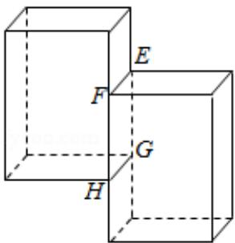

> [!faq]- 2020年全国统一高考数学试卷（理科）（新课标ⅱ）（含解析版）解析
>
> > [!success]- **【答案】** A
>
> > [!note]- **【分析】**
> > 首先把三视图转换为直观图，进一步求出图形中的对应点.
>
> > [!note]- **【解析】**
> > 分析】首先把三视图转换为直观图，进一步求出图形中的对应点.
> >
> > 【
> > 解答】解：根据几何体的三视图转换为直观图：
> >
> > 根据三视图和几何体的的对应关系的应用，这个多面体某条棱的一个端点在正视图中对应的点为 $M$ ，在俯视图中对应的点为 $N$
> >
> > 所以在侧视图中与点 E 对应.
> >
> > 故选：A.
> >
> > 
> >
> > 【点评】本题考查的知识要点：三视图和几何体的直观图之间的转换、主要考查学生的运算能力和转换能力及思维能力，属于基础题型.
