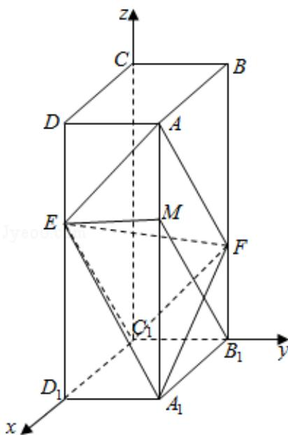

> [!faq]- 2020年全国统一高考数学试卷（理科）（新课标ⅲ）（含解析版）解析
>
> > [!success]- **【答案】** (12 分) 如图, 在长方体 $ABCD - A_{1}B_{1}C_{1}D_{1}$ 中, 点 $E$ , $F$ 分别在棱 $DD_{1}$ , $BB_{1}$ 上, 且 $2DE = ED_{1}$ , $BF =
>
> > [!note]- **【分析】**
> > （1）在 $AA_{1}$ 上取点 M，使得 $A_{1}M=2AM$ ，连接 EM, $B_{1}M$ , $EC_{1}$ , $FC_{1}$ ，由已知证明四边形 $B_{1}FAM$ 和四边形 EDAM 都是平行四边形，可得 $AF\|MB_{1}$ ，且 $AF=MB_{1}$ , $AD\|ME$ ，且 AD=ME，进一步证明四边形 $B_{1}C_{1}EM$ 为平行四边形，得到 $EC_{1}\|MB_{1}$ ，且 $EC_{1}=MB_{1}$ ，结合 $AF\|MB_{1}$ ，且 $AF=MB_{1}$ ，可得 $AF\|EC_{1}$ ，且 $AF=EC_{1}$ ，则四边形 $AFC_{1}E$ 为平行四边形，从而得到点 $C_{1}$ 在平面 AEF 内；
> > (2) 在长方体 $ABCD - A_{1}B_{1}C_{1}D_{1}$ 中，以 $C_{1}$ 为坐标原点，分别以 $C_{1}D_{1}, C_{1}B_{1}, C_{1}C$ 所在直线为 $x, y, z$ 轴建立空间直角坐标系。分别求出平面 $AEF$ 的一个法向量与平面 $A_{1}EF$ 的一个法向量，由两法向量所成角的余弦值可得二面角 $A - EF - A_{1}$ 的余弦值，再由同角三角函数基本关系式求得二面角 $A - EF - A_{1}$ 的正弦值。
>
> > [!note]- **【解析】**
> > （1）证明：在 $AA_{1}$ 上取点M，使得 $A_{1}M=2AM$ ，连接EM， $B_{1}M$ ， $EC_{1}$ ， $FC_{1}$ ，在长方体 $ABCD-A_{1}B_{1}C_{1}D_{1}$ 中，有 $DD_{1}\|AA_{1}\|BB_{1}$ ，且 $DD_{1}=AA_{1}=BB_{1}$ .
> >
> > 又 $2DE = ED_{1}$ ， $A_{1}M = 2AM$ ， $BF = 2FB_{1}$ ， $\therefore DE = AM = FB_{1}$ $\therefore$ 四边形 $B_{1}FAM$ 和四边形EDAM都是平行四边形. $\therefore AF\| MB_1$ ，且 $AF = MB_{1}$ ， $AD\| ME$ ，且 $AD = ME$ .  
> > 又在长方体ABCD- $A_{1}B_{1}C_{1}D_{1}$ 中，有 $AD\| B_1C_1$ ，且 $AD = B_{1}C_{1}$ $\therefore B_1C_1\| ME$ 且 $B_{1}C_{1} = ME$ ，则四边形 $B_{1}C_{1}EM$ 为平行四边形，
> >
> > $\therefore EC_{1}\| MB_{1}$ ，且 $EC_1 = MB_1$
> >
> > 又 $AF\|MB_{1}$ ，且 $AF=MB_{1}$ ，∴ $AF\|EC_{1}$ ，且 $AF=EC_{1}$ ，
> >
> > 则四边形 $AFC_{1}E$ 为平行四边形，
> >
> > ∴点 $C_{1}$ 在平面 AEF 内；
> > (2) 解: 在长方体 $ABCD - A_{1}B_{1}C_{1}D_{1}$ 中, 以 $C_{1}$ 为坐标原点,
> >
> > 分别以 $C_{1}D_{1}$ ， $C_{1}B_{1}$ ， $C_{1}C$ 所在直线为 x，y，z 轴建立空间直角坐标系.
> >
> > $$
> > \because A B = 2, A D = 1, A A _ {1} = 3, 2 D E = E D _ {1}, B F = 2 F B _ {1},
> > $$
> >
> > $\therefore A(2,1,3),B(2,0,2),F(0,1,1),A_{1}(2,1,0)$
> >
> > 则 $\overrightarrow{EF} = (-2, 1, -1)$ , $\overrightarrow{AE} = (0, -1, -1)$ , $\overrightarrow{A_1E} = (0, -1, 2)$ .
> >
> > 设平面 $AEF$ 的一个法向量为 $\overrightarrow{\mathrm{n}_1} = (\mathrm{x}_1, \mathrm{y}_1, \mathrm{z}_1)$ .
> >
> > 则 $\left\{ \begin{array}{l} \overrightarrow{\mathrm{n}_1} \cdot \overrightarrow{\mathrm{EF}} = -2\mathrm{x}_1 + \mathrm{y}_1 - \mathrm{z}_1 = 0 \\ \overrightarrow{\mathrm{n}_1} \cdot \overrightarrow{\mathrm{AE}} = -\mathrm{y}_1 - \mathrm{z}_1 = 0 \end{array} \right.$ ，取 $x_1 = 1$ ，得 $\overrightarrow{\mathrm{n}_1} = (1, 1, -1)$ ；
> >
> > 设平面 $A_{1}EF$ 的一个法向量为 $\overrightarrow{\mathrm{n}_2} = (\mathbf{x}_2,\mathbf{y}_2,\mathbf{z}_2)$
> >
> > 则 $\left\{ \begin{array}{l} \overrightarrow{\mathrm{n}_2} \cdot \overrightarrow{\mathrm{EF}} = -2\mathrm{x}_2 + \mathrm{y}_2 - \mathrm{z}_2 = 0 \\ \overrightarrow{\mathrm{n}_2} \cdot \overrightarrow{\mathrm{A}_1\mathrm{E}} = -\mathrm{y}_2 + 2\mathrm{z}_2 = 0 \end{array} \right.$ ，取 $x_2 = 1$ ，得 $\overrightarrow{\mathrm{n}_2} = (1, 4, 2)$ .
> >
> > $\therefore \cos < \overrightarrow{n_1}, \overrightarrow{n_2} > = \frac{\overrightarrow{n_1} \cdot \overrightarrow{n_2}}{|\overrightarrow{n_1}| \cdot |\overrightarrow{n_2}|} = \frac{1 + 4 - 2}{\sqrt{3} \cdot \sqrt{21}} = \frac{\sqrt{7}}{7}$ .
> >
> > 设二面角 $A - EF - A_{1}$ 为 $\theta$ ，则 $\sin \theta = \sqrt{1 - \frac{1}{7}} = \frac{\sqrt{42}}{7}$
> >
> > ∴二面角 $A - EF - A_{1}$ 的正弦值为 $\frac{\sqrt{42}}{7}$ .
> >
> > 
