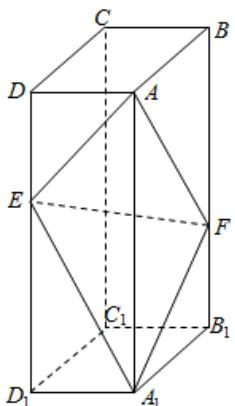

<!-- question-source:start -->
19.（12分）如图，在长方体 $ABCD - A_{1}B_{1}C_{1}D_{1}$ 中，点 $E, F$ 分别在棱 $DD_{1}, BB_{1}$ 上，且 $2DE = ED_{1}, BF = 2FB_{1}$ .

(1) 证明: 点 $C_{1}$ 在平面 $AEF$ 内;

(2) 若 AB=2, AD=1, $AA_{1}=3$ ，求二面角 A-EF-A $_{1}$ 的正弦值.

<!-- question-source:end -->

![[高中/真题/按年份分类/2020/2020年全国统一高考数学试卷_理科__新课标ⅲ__含解析版_/解答题/题目/answers/Q00024286A1.md]]
