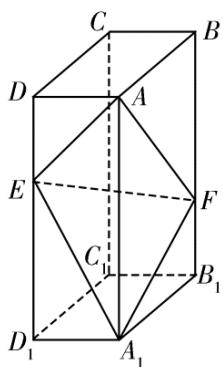

<!-- question-source:start -->
19.如图，在长方体 $ABCD - A_{1}B_{1}C_{1}D_{1}$ 中，点 $E,F$ 分别在棱 $DD_{1},BB_{1}$ 上，且 $2DE = ED_{1}$

$$
B F = 2 F B _ {1}
$$

<!-- question-source:end -->

![[高中/真题/按年份分类/2020/2020年全国统一高考数学试卷_理科__新课标ⅲ__含解析版_/解答题/题目/answers/Q00029107A1.md]]
