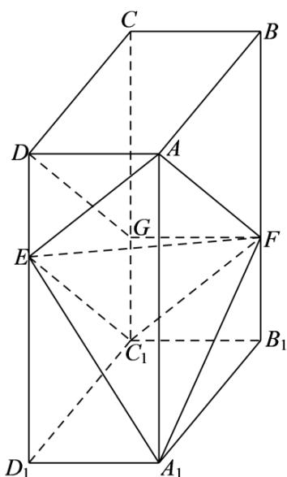
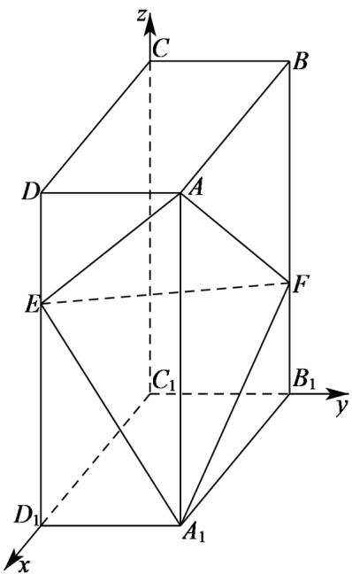

> [!faq]- 2020年全国统一高考数学试卷（理科）（新课标ⅲ）（含解析版）解析
>
> > [!success]- **【答案】** （1）证明见
>
> > [!note]- **【分析】**
> > (1) 连接 $C_{1}E$ 、 $C_{1}F$ ，证明出四边形 $AEC_{1}F$ 为平行四边形，进而可证得点 $C_{1}$ 在平面 AEF 内；
>
> > [!note]- **【解析】**
> > （1）在棱 $CC_{1}$ 上取点G，使得 $C_{1}G=\frac{1}{2}CG$ ，连接DG、FG、 $C_{1}E$ 、 $C_{1}F$ ，
> >
> > 
> >
> > 在长方体 $ABCD - A_{1}B_{1}C_{1}D_{1}$ 中， $AD \parallel BC$ 且 AD = BC， $BB_{1} \parallel CC_{1}$ 且 $BB_{1} = CC_{1}$
> >
> > $$
> > \because C _ {1} G = \frac {1}{2} C G, B F = 2 F B _ {1}, \therefore C G = \frac {2}{3} C C _ {1} = \frac {2}{3} B B _ {1} = B F \text {且} C G = B F,
> > $$
> >
> > 所以，四边形 BCGF 为平行四边形，则 AF // DG 且 AF = DG，
> >
> > 同理可证四边形 $DEC_{1}G$ 为平行四边形， $\therefore C_{1}E//DG$ 且 $C_{1}E=DG$ ，
> >
> > $\therefore C_{1}E//AF$ 且 $C_1E = AF$ ，则四边形 $AEC_{1}F$ 为平行四边形，
> >
> > 因此，点 $C_1$ 在平面 $AEF$ 内；
> >
> > (2) 以点 $C_{1}$ 为坐标原点， $C_{1}D_{1}$ 、 $C_{1}B_{1}$ 、 $C_{1}C$ 所在直线分别为 $x$ 、 $y$ 、 $z$ 轴建立如下图所示的空间
> >
> > 直角坐标系 $C_{1}-xyz$
> >
> > 则 $A(2,1,3)$ 、 $A_{1}(2,1,0)$ 、 $E(2,0,2)$ 、 $F(0,1,1)$
> >
> > $$
> > A E = (0, - 1, - 1), A F = (- 2, 0, - 2), A _ {1} E = (0, - 1, 2), A _ {1} F = (- 2, 0, 1),
> > $$
> >
> > 设平面 AEF 的法向量为 $m=(x_{1},y_{1},z_{1})$ ,
> >
> > 由 $\left\{ \begin{array}{l} m \cdot AE = 0 \\ m \cdot AF = 0 \end{array} \right.$ ，得 $\left\{ \begin{array}{l} -y_1 - z_1 = 0 \\ -2x_1 - 2z_1 = 0 \end{array} \right.$ 取 $z_1 = -1$ ，得 $x_1 = y_1 = 1$ ，则 $m = (1,1,-1)$ ，
> >
> > 设平面 $A_{1}EF$ 的法向量为 $n=(x_{2},y_{2},z_{2})$ ,
> >
> > 由 $\left\{ \begin{array}{l} n \cdot A_1 E = 0 \\ n \cdot A_1 F = 0 \end{array} \right.$ ，得 $\left\{ \begin{array}{l} -y_2 + 2z_2 = 0 \\ -2x_2 + z_2 = 0 \end{array} \right.$ ，取 $z_2 = 2$ ，得 $x_2 = 1, y_2 = 4$ ，则 $n = (1,4,2)$ ，
> >
> > 
> >
> > $$
> > \cos <   m, n > = \frac {m \cdot n}{| m | \cdot | n |} = \frac {3}{\sqrt {3} \times \sqrt {2 1}} = \frac {\sqrt {7}}{7},
> > $$
> >
> > 设二面角 $A - EF - A_{1}$ 的平面角为 $\theta$ ，则 $\left|\cos \theta \right| = \frac{\sqrt{7}}{7}$ ， $\therefore \sin \theta = \sqrt{1 - \cos^2 \theta} = \frac{\sqrt{42}}{7}$ .
> >
> > 因此，二面角 $A - EF - A_{1}$ 的正弦值为 $\frac{\sqrt{42}}{7}$
> >
> > 【点睛】本题考查点在平面的证明, 同时也考查了利用空间向量法求解二面角角, 考查推理能力与计算能力, 属于中等题.
