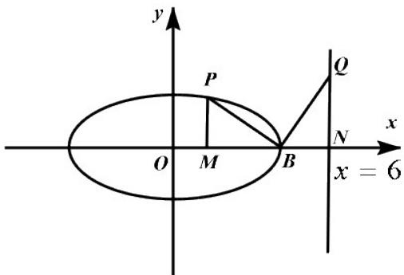
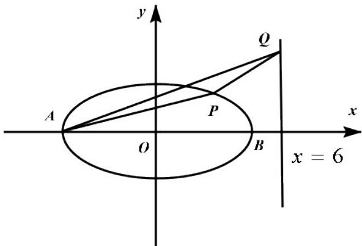
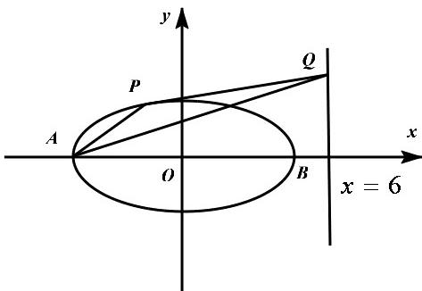

> [!faq]- 2020年全国统一高考数学试卷（理科）（新课标ⅲ）（含解析版）解析
>
> > [!success]- **【答案】** (1) $\frac{x^2}{25} +\frac{16y^2}{25} = 1$ (2) $\frac{5}{2}$ 【
>
> > [!note]- **【分析】**
> > (1) 因为 $C: \frac{x^{2}}{25} + \frac{y^{2}}{m^{2}} = 1 (0 < m < 5)$ ，可得 a = 5, b = m，根据离心率公式，结合已知，即可求得
>
> > [!note]- **【解析】**
> > （1）∵ $C:\frac{x^{2}}{25}+\frac{y^{2}}{m^{2}}=1(0<m<5)$
> >
> > $$
> > \therefore a = 5, b = m,
> > $$
> >
> > 根据离心率 $e = \frac{c}{a} = \sqrt{1 - \left(\frac{b}{a}\right)^2} = \sqrt{1 - \left(\frac{m}{5}\right)^2} = \frac{\sqrt{15}}{4}$
> >
> > 解得 $m=\frac{5}{4}$ 或 $m=-\frac{5}{4}$ (舍),
> >
> > 的方程为： $\frac{x^{2}}{25}+\frac{y^{2}}{\left(\frac{5}{4}\right)^{2}}=1$ ∴ C
> >
> > 即 $\frac{x^{2}}{25}+\frac{16y^{2}}{25}=1$ ;
> >
> > (2) $\because$ 点 $P$ 在 $C$ 上，点 $Q$ 在直线 $x = 6$ 上，且 $|BP| \neq |BQ|$ ， $BP \perp BQ$
> >
> > 过点 $P$ 作 $x$ 轴垂线，交点为 $M$ ，设 $x = 6$ 与 $x$ 轴交点为 $N$
> >
> > 根据题意画出图形，如图
> >
> > 
> >
> > $\because |BP|\neq BQ|,\quad BP\perp BQ,\quad \angle PMB = \angle QNB = 90^{\circ},$
> >
> > 又∵ $\angle PBM + \angle QBN = 90^{\circ}$ ， $\angle BQN + \angle QBN = 90^{\circ}$
> >
> > $$
> > \therefore \angle P B M = \angle B Q N
> > $$
> >
> > 根据三角形全等条件 “AAS”，
> >
> > 可得： $\triangle PMB \cong \triangle BNQ$
> >
> > $$
> > \because \frac {x ^ {2}}{2 5} + \frac {1 6 y ^ {2}}{2 5} = 1,
> > $$
> >
> > $$
> > \therefore B (5, 0)
> > $$
> >
> > $$
> > \therefore | P M | = | B N | = 6 - 5 = 1
> > $$
> >
> > 设 P 点为 $(x_{P}, y_{P})$ ,
> >
> > 可得 P 点纵坐标为 $y_{P}=1$ ，将其代入 $\frac{x^{2}}{25}+\frac{16y^{2}}{25}=1$ ，
> >
> > 可得： $\frac{x_{p}^{2}}{25}+\frac{16}{25}=1$ ，
> >
> > 解得： $x_{P}=3$ 或 $x_{P}=-3$
> >
> > $\therefore P_{\text{点为}}(3,1)\text{或}(-3,1)$
> >
> > ① 当 $P$ 点为 $(3,1)$ 时，
> >
> > 故 $\left|MB\right|=5-3=2$
> >
> > $$
> > \because \triangle P M B \cong \triangle B N Q
> > $$
> >
> > $$
> > \therefore | M B | \neq N Q | = 2
> > $$
> >
> > 可得： $Q_{点为}(6,2)$ ，
> >
> > 画出图象，如图
> >
> > 
> >
> > ∵ $A(-5,0)$ , $Q(6,2)$ ,
> >
> > 可求得直线 $AQ$ 的直线方程为： $2x - 11y + 10 = 0$
> >
> > 根据点到直线距离公式可得 $_{P}$ 到直线 AQ 的距离为： $d=\frac{|2\times3-11\times1+10|}{\sqrt{2^{2}+11^{2}}}=\frac{|5|}{\sqrt{125}}=\frac{\sqrt{5}}{5}$
> >
> > 根据两点间距离公式可得： $\left|AQ\right|=\sqrt{(6+5)^{2}+(2-0)^{2}}=5\sqrt{5}$
> >
> > ∴ $\triangle APQ$ 面积为： $\frac{1}{2} \times 5\sqrt{5} \times \frac{\sqrt{5}}{5} = \frac{5}{2}$ ;
> >
> > ② 当 $P$ 点 $(-3,1)$ 时，
> >
> > 故 $\left|MB\right|=5+3=8$ ，
> >
> > $$
> > \because \triangle P M B \cong \triangle B N Q
> > $$
> >
> > $$
> > \therefore | M B | \neq N Q | = 8
> > $$
> >
> > 可得： $Q_{\text{点为}}(6,8)$
> >
> > 画出图象，如图
> >
> > 
> >
> > ∵ $A(-5,0)$ , $Q(6,8)$ ,
> >
> > 可求得直线 $AQ$ 的直线方程为： $8x - 11y + 40 = 0$ ，
> >
> > 根据点到直线距离公式可得 $P$ 到直线 $AQ$ 的距离为：
> >
> > $$
> > d = \frac {\left| 8 \times (- 3) - 1 1 \times 1 + 4 0 \right|}{\sqrt {8 ^ {2} + 1 1 ^ {2}}} = \frac {| 5 |}{\sqrt {1 8 5}} = \frac {5}{\sqrt {1 8 5}},
> > $$
> >
> > 根据两点间距离公式可得： $\left|AQ\right|=\sqrt{(6+5)^{2}+(8-0)^{2}}=\sqrt{185}$
> >
> > ∴ $\triangle APQ$ 面积为： $\frac{1}{2} \times \sqrt{185} \times \frac{5}{\sqrt{185}} = \frac{5}{2}$ ,
> >
> > 综上所述， $\triangle APQ$ 面积为： $\frac{5}{2}$ .
> >
> > 【点睛】本题主要考查了求椭圆标准方程和求三角形面积问题，解题关键是掌握椭圆的离心率定义和数形结合求三角形面积，考查了
