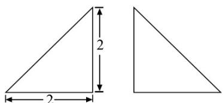
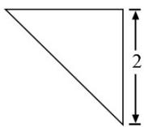

<!-- question-source:start -->
8.下图为某几何体的三视图，则该几何体的表面积是（）

A. $6 + 4\sqrt{2}$ B. $4 + 4\sqrt{2}$ C. $6 + 2\sqrt{3}$ D. $4 + 2\sqrt{3}$

【
<!-- question-source:end -->

![[高中/真题/按年份分类/2020/2020年全国统一高考数学试卷_理科__新课标ⅲ__含解析版_/选择题/题目/answers/Q00022293A1.md]]
