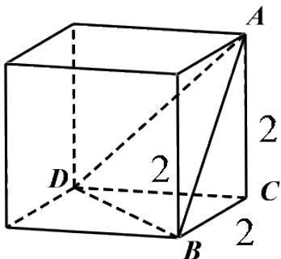

> [!faq]- 2020年全国统一高考数学试卷（理科）（新课标ⅲ）（含解析版）解析
>
> > [!success]- **【答案】** C
>
> > [!note]- **【分析】**
> > 根据三视图特征，在正方体中截取出符合题意的立体图形，求出每个面的面积，即可求得其表面积.
>
> > [!note]- **【解析】**
> > 根据三视图特征，在正方体中截取出符合题意的立体图形
> >
> > 
> >
> > 根据立体图形可得： $S_{\triangle ABC}=S_{\triangle ADC}=S_{\triangle CDB}=\frac{1}{2}\times2\times2=2$
> >
> > 根据勾股定理可得： $AB = AD = DB = 2\sqrt{2}$
> >
> > $\therefore \triangle ADB$ 是边长为 $2\sqrt{2}$ 的等边三角形
> >
> > 根据三角形面积公式可得：
> >
> > $$
> > S _ {\triangle A D B} = \frac {1}{2} A B \cdot A D \cdot \sin 6 0 ^ {\circ} = \frac {1}{2} (2 \sqrt {2}) ^ {2} \cdot \frac {\sqrt {3}}{2} = 2 \sqrt {3}
> > $$
> >
> > $\therefore$ 该几何体的表面积是： $3\times 2 + 2\sqrt{3} = 6 + 2\sqrt{3}$
> >
> > 故选：C.
> >
> > 【点睛】本题主要考查了根据三视图求立体图形的表面积问题，解题关键是掌握根据三视图画出立体图形，考查了
