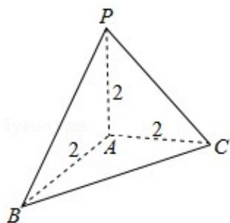

> [!faq]- 2020年全国统一高考数学试卷（理科）（新课标ⅲ）（含解析版）解析
>
> > [!success]- **【答案】** C
>
> > [!note]- **【分析】**
> > 先由三视图画出几何体的直观图，利用三视图的数据，利用三棱锥的表面积公式计算即可.
>
> > [!note]- **【解析】**
> > 解：由三视图可知，几何体的直观图是正方体的一个角，如图：
> >
> > $PA=AB=AC=2,\ PA、AB、AC$ 两两垂直，
> >
> > 故 $PB = BC = PC = 2\sqrt{2}$
> >
> > 几何体的表面积为： $3 \times \frac{1}{2} \times 2 \times 2 + \frac{\sqrt{3}}{4} \times (2\sqrt{2})^{2} = 6 + 2\sqrt{3}$ ,
> >
> > 故选：C.
> >
> > 
> >
> > 【点评】本题考查多面体的表面积的求法，几何体的三视图与直观图的应用，考查空间想象能力，计算能力.
