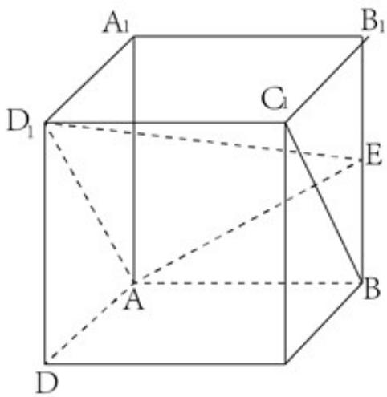

<!-- question-source:start -->
16.如图，在正方体 $ABCD - A_{1}B_{1}C_{1}D_{1}$ 中， $E$ 为 $BB_{1}$ 的中点.

（Ⅰ）求证： $BC_{1} //$ 平面 $AD_{1}E$ ;

（II）求直线 $AA_{1}$ 与平面 $AD_{1}E$ 所成角的正弦值.

【
<!-- question-source:end -->

![[高中/真题/按年份分类/2020/2020年北京市高考文科数学试卷_含解析版_/三_解答题共6小题_共85分_/题目/answers/Q00021658A1.md]]
