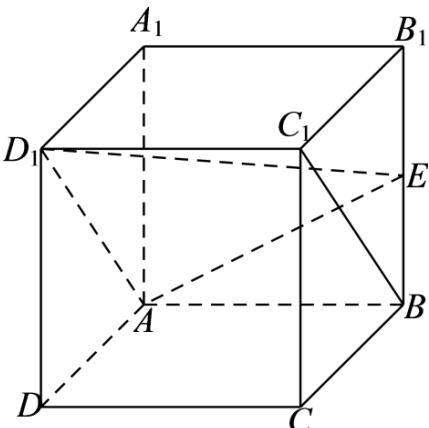
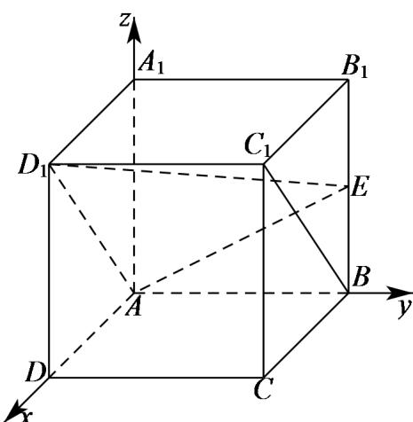

> [!faq]- 2020年北京市高考文科数学试卷（含解析版）解析
>
> > [!success]- **【答案】** （I）证明见
>
> > [!note]- **【分析】**
> > （I）证明出四边形 $ABC_{1}D_{1}$ 为平行四边形，可得出 $BC_{1} / / AD_{1}$ ，然后利用线面平行的判定定理可证得结论；
>
> > [!note]- **【解析】**
> > （I）如下图所示：
> >
> > 
> >
> > 在正方体 $ABCD - A_{1}B_{1}C_{1}D_{1}$ 中， $AB//A_{1}B_{1}$ 且 $AB = A_{1}B_{1}$ ， $A_{1}B_{1}//C_{1}D_{1}$ 且 $A_{1}B_{1} = C_{1}D_{1}$ ， $\therefore AB//C_{1}D_{1}$ 且 $AB=C_{1}D_{1}$ ，所以，四边形 $ABC_{1}D_{1}$ 为平行四边形，则 $BC_{1}//AD_{1}$ ， $\because BC_{1}\notin\text{平面}AD_{1}E,\quad AD_{1}\subset\text{平面}AD_{1}E,\quad\therefore BC_{1}//\text{平面}AD_{1}E;$
> >
> > （Ⅱ）以点 A 为坐标原点，AD、AB、 $AA_{1}$ 所在直线分别为 x、y、z 轴建立如下图所示的空间
> > 直角坐标系 A - xyz ，
> >
> > 
> >
> > 设正方体 $ABCD - A_{1}B_{1}C_{1}D_{1}$ 的棱长为2，则 $A(0,0,0)$ 、 $A_{1}(0,0,2)$ 、 $D_{1}(2,0,2)$ 、 $E(0,2,1)$ ， $AD_{1} = (2,0,2)$ ， $AE = (0,2,1)$ ，
> >
> > 设平面 $AD_{1}E$ 的法向量为 $n=(x,y,z)$ ，由 $\left\{\begin{aligned}\underline{n}\cdot AD_{1}&=0\\n\cdot AE&=0\end{aligned}\right.$ ，得 $\left\{\begin{aligned}2x+2z&=0\\2y+z&=0\end{aligned}\right.$ ，
> >
> > 令 z = -2，则 x = 2，y = 1，则 $n = (2, 1, -2)$ .
> >
> > $$
> > \cos <   n, A A _ {1} > = \frac {n \cdot A A _ {1}}{| n | \cdot | A A _ {1} |} = - \frac {4}{3 \times 2} = - \frac {2}{3}.
> > $$
> >
> > 因此，直线 $AA_{1}$ 与平面 $AD_{1}E$ 所成角的正弦值为 $\frac{2}{3}$ .
> >
> > 【点睛】本题考查线面平行的证明，同时也考查了利用空间向量法计算直线与平面所成角的正弦值，考查计算能力，属于基础题.
