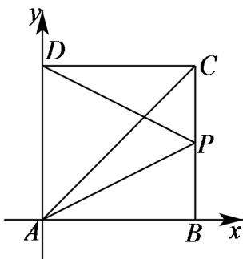

> [!faq]- 2020年北京市高考文科数学试卷（含解析版）解析
>
> > [!success]- **【答案】** (1). $\sqrt{5}$ (2). -1 以点 A 为坐标原点，AB、AD 所在直线分别为 x、y 轴建立平面直角坐标系，求得点 P 的坐标， 利用平面向量数量积的坐标运算可求得 $\left|PD\right|$ 以及 $PB\cdot PD$ 的值. 【
>
> > [!note]- **【分析】**
> > 本题未单列分析。
>
> > [!note]- **【解析】**
> > 以点 A 为坐标原点，AB、AD 所在直线分别为 x、y 轴建立如下图所示的平面直角坐
> > 标系，
> >
> > 
> >
> > 则点 $A(0,0)$ 、 $B(2,0)$ 、 $C(2,2)$ 、 $D(0,2)$ ，
> >
> > $$
> > A P = \frac {1}{2} (A B + A C) = \frac {1}{2} (2, 0) + \frac {1}{2} (2, 2) = (2, 1),
> > $$
> >
> > 则点 $P(2,1)$ ，∴ $PD=(-2,1)$ ， $PB=(0,-1)$ ，
> >
> > 因此， $\left|PD\right|=\sqrt{(-2)^{2}+1^{2}}=\sqrt{5}$ ， $PB\cdot PD=0\times(-2)+1\times(-1)=-1$ .
> >
> > 故
