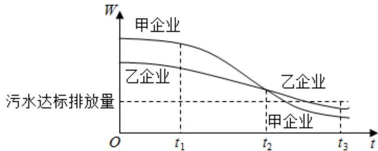

<!-- question-source:start -->
15.为满足人民对美好生活的向往，环保部门要求相关企业加强污水治理，排放未达标的企业

要限期整改、设企业的污水摆放量 $W$ 与时间 $t$ 的关系为 $W = f(t)$ ，用 $-\frac{f(b) - f(a)}{b - a}$ 的大小评

价在 $[a,b]$ 这段时间内企业污水治理能力的强弱，已知整改期内，甲、乙两企业的污水排放量与时间的关系如下图所示.

给出下列四个结论：

① 在 $\left[t_{1}, t_{2}\right]$ 这段时间内，甲企业的污水治理能力比乙企业强；

② 在 $t_2$ 时刻，甲企业的污水治理能力比乙企业强；

③ 在 $t_{3}$ 时刻，甲、乙两企业的污水排放都已达标；

④ 甲企业在 $\left[0, t_1\right], \left[t_1, t_2\right], \left[t_2, t_3\right]$ 这三段时间中，在 $\left[0, t_1\right]$ 的污水治理能力最强.

其中所有正确结论的序号是\_\_\_\_。
<!-- question-source:end -->

![[高中/真题/按年份分类/2020/2020年北京市高考理科数学试卷_含解析版_/填空题/题目/answers/Q00030771A1.md]]
