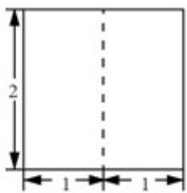
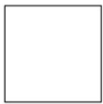
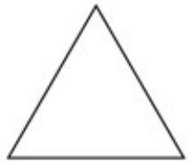

<!-- question-source:start -->
4. 某三棱柱的底面为正三角形，其三视图如图所示，该三棱柱的表面积为（）.

  
正（主）视图

  
侧（左）视图  
俯视图

A. $6 + \sqrt{3}$ B. $6 + 2\sqrt{3}$ C. $12 + \sqrt{3}$ D. $12 + 2\sqrt{3}$

【
<!-- question-source:end -->

![[高中/真题/按年份分类/2020/2020年北京市高考理科数学试卷_含解析版_/选择题/题目/answers/Q00021646A1.md]]
