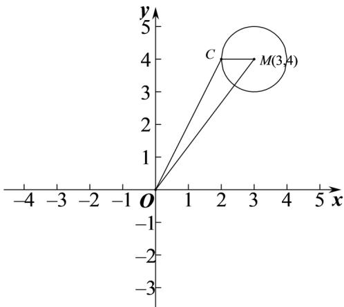

> [!faq]- 2020年北京市高考理科数学试卷（含解析版）解析
>
> > [!success]- **【答案】** A
>
> > [!note]- **【分析】**
> > 求出圆心 C 的轨迹方程后，根据圆心 M 到原点 O 的距离减去半径 1 可得
>
> > [!note]- **【解析】**
> > 设圆心 $C(x,y)$ ，则 $\sqrt{(x-3)^{2}+(y-4)^{2}}=1$ ，
> >
> > 化简得 $(x-3)^{2}+(y-4)^{2}=1$
> >
> > 所以圆心 $C$ 的轨迹是以 $M(3,4)$ 为圆心，1为半径的圆，
> >
> > 
> >
> > 所以 $|OC|+1\geq OM|=\sqrt{3^{2}+4^{2}}=5$ ，所以 $|OC|\geq5-1=4$
> >
> > 当且仅当 $C$ 在线段 $OM$ 上时取得等号，
> >
> > 故选：A.
> >
> > 【点睛】本题考查了圆的标准方程，属于基础题.
