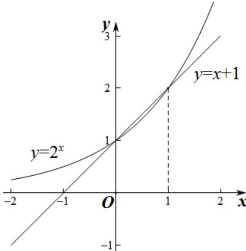

> [!faq]- 2020年北京市高考理科数学试卷（含解析版）解析
>
> > [!success]- **【答案】** D
>
> > [!note]- **【分析】**
> > 作出函数 $y=2^{x}$ 和 $y=x+1$ 的图象，观察图象可得结果.
>
> > [!note]- **【解析】**
> > 因为 $f(x)=2^{x}-x-1$ ，所以 $f(x)>0$ 等价于 $2^{x}>x+1$ ，
> >
> > 在同一直角坐标系中作出 $y = 2^{x}$ 和 $y = x + 1$ 的图象如图：
> >
> > 
> >
> > 两函数图象的交点坐标为 $(0,1),(1,2)$ ,
> >
> > 不等式 $2^{x} > x + 1$ 的解为 $x < 0$ 或 $x > 1$ .
> >
> > 所以不等式 $f(x) > 0$ 的解集为： $(- \infty, 0) \cup (1, +\infty)$ .
> >
> > 故选：D.
> >
> > 【点睛】本题考查了图象法解不等式，属于基础题.
