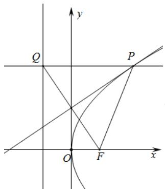

> [!faq]- 2020年北京市高考理科数学试卷（含解析版）解析
>
> > [!success]- **【答案】** B
>
> > [!note]- **【分析】**
> > 依据题意不妨作出焦点在 $X$ 轴上的开口向右的抛物线，根据垂直平分线的定义和抛物线的定
> > 义可知，线段 $FQ$ 的垂直平分线经过点 $P$ ，即求解.
>
> > [!note]- **【解析】**
> > 如图所示：
> >
> > 
> >
> > 因为线段 $FQ$ 的垂直平分线上的点到 $F, Q$ 的距离相等，又点 $P$ 在抛物线上，根据定义可知， $\left|PQ\right| = \left|PF\right|$ ，所以线段 $FQ$ 的垂直平分线经过点 $P$ 。
> >
> > 故选：B.
> >
> > 【点睛】本题主要考查抛物线的定义的应用，属于基础题.
