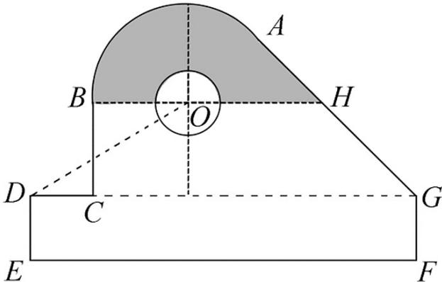

<!-- question-source:start -->
16. 某中学开展劳动实习, 学生加工制作零件, 零件的截面如图所示. $O$ 为圆孔及轮廓圆弧 $AB$ 所在圆的圆心, $A$ 是圆弧 $AB$ 与直线 $AG$ 的切点, $B$ 是圆弧 $AB$ 与直线 $BC$ 的切点, 四边形 $DEFG$ 为矩形, $BC \perp DG$ , 垂足为 $C$ , $\tan \angle ODC = \frac{3}{5}$ , $BH // DG$ , $EF = 12 \text{ cm}$ , $DE = 2 \text{ cm}$ , $A$ 到直线 $DE$ 和 $EF$ 的距离均为 $7 \text{ cm}$ , 圆孔半径为 $1 \text{ cm}$ , 则图中阴影部分的面积为 \_\_\_\_ $\text{cm}^2$ .

<!-- question-source:end -->

![[高中/真题/按年份分类/2020/2020年新高考全国卷Ⅱ数学试题_海南卷_含答案/填空题/题目/answers/Q00027578A1.md]]
