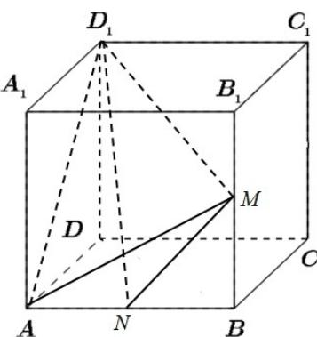

> [!faq]- 2020年新高考全国卷Ⅱ数学试题（海南卷）含答案解析
>
> > [!success]- **【答案】** $\frac{1}{3}$ 【
>
> > [!note]- **【分析】**
> > 利用 $V_{A - NMD_1} = V_{D_1 - AMN}$ 计算即可.
>
> > [!note]- **【解析】**
> > 
> >
> > 因为正方体 $ABCD-A_{1}B_{1}C_{1}D_{1}$ 的棱长为 2，M、N 分别为 $BB_{1}$ 、AB 的中点
> > 所以 $V_{A-NMD_{1}} = V_{D_{1}-AMN} = \frac{1}{3} \times \frac{1}{2} \times 1 \times 1 \times 2 = \frac{1}{3}$
> >
> > 故
