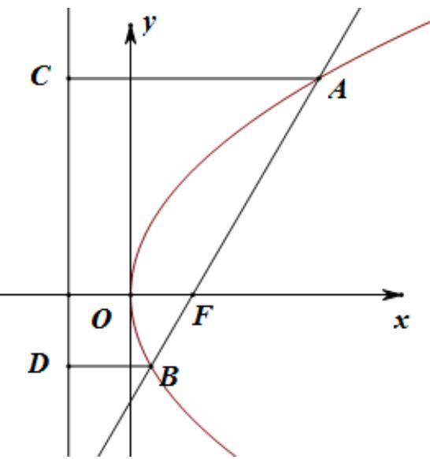

> [!faq]- 2020年新高考全国卷Ⅱ数学试题（海南卷）含答案解析
>
> > [!success]- **【答案】** $\frac{16}{3}$
>
> > [!note]- **【分析】**
> > 先根据抛物线的方程求得抛物线焦点坐标，利用点斜式得直线方程，与抛物线方程联立消去 $y$ 并整理得到关于 $x$ 的二次方程，接下来可以利用弦长公式或者利用抛物线定义将焦点弦长转化求得结果.
>
> > [!note]- **【解析】**
> > ∵抛物线的方程为 $y^{2}=4x$ ，∴抛物线的焦点 F 坐标为 $F(1,0)$ ，
> >
> > 又∵直线AB过焦点F且斜率为 $\sqrt{3}$ ，∴直线AB的方程为： $y=\sqrt{3}(x-1)$
> >
> > 代入抛物线方程消去 y 并化简得 $3x^{2}-10x+3=0$ ，
> >
> > 解法一：解得 $x_{1} = \frac{1}{3}, x_{2} = 3$
> >
> > 所以 $|AB| = \sqrt{1 + k^2} |x_1 - x_2| = \sqrt{1 + 3} \cdot |3 - \frac{1}{3}| = \frac{16}{3}$
> >
> > 解法二： $\Delta = 100 - 36 = 64 > 0$
> >
> > 设 $A(x_{1},y_{1}), B(x_{2},y_{2})$ ，则 $x_{1} + x_{2} = \frac{10}{3}$ ，
> >
> > 过 $A, B$ 分别作准线 $x = -1$ 的垂线，设垂足分别为 $C, D$ 如图所示.
> >
> > $$
> > \mid A B \mid \nexists A F \mid + \mid B F \mid \nexists A C \mid + \mid B D \mid = x _ {1} + 1 + x _ {2} + 1 = x _ {1} + x _ {2} + 2 = \frac {1 6}{3}
> > $$
> >
> > 
> >
> > 故答案为： $\frac{16}{3}$
> >
> > 【点睛】本题考查抛物线焦点弦长，涉及利用抛物线的定义进行转化，弦长公式，属基础题.
