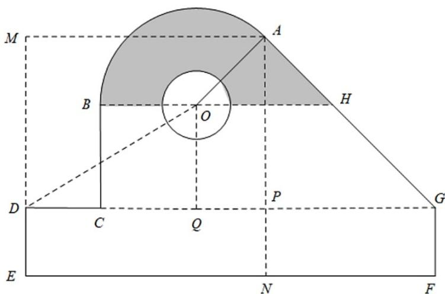

> [!faq]- 2020年新高考全国卷Ⅱ数学试题（海南卷）含答案解析
>
> > [!success]- **【答案】** $4 + \frac{5}{2}\pi$ 【
>
> > [!note]- **【分析】**
> > 利用 $\tan \angle ODC = \frac{3}{5}$ 求出圆弧 $AB$ 所在圆的半径，结合扇形的面积公式求出扇形 $AOB$ 的面积，求出直角
>
> > [!note]- **【解析】**
> > 设 OB = OA = r ，由题意 AM = AN = 7 ， EF = 12 ，所以 NF = 5 ，
> >
> > 
> >
> > 因为 $AP = 5$ ，所以 $\angle AGP = 45^{\circ}$
> >
> > 因为 $BH \parallel DG$ ，所以 $\angle AHO = 45^{\circ}$ ，
> >
> > 因为 AG 与圆弧 AB 相切于 A 点，所以 $OA \perp AG$ ，
> >
> > 即 $\triangle OAH$ 为等腰直角三角形；
> >
> > 在直角 $\triangle OQD$ 中， $OQ=5-\frac{\sqrt{2}}{2}r$ ， $DQ=7-\frac{\sqrt{2}}{2}r$ ，
> >
> > 因为 $\tan\angle ODC=\frac{OQ}{DQ}=\frac{3}{5}$ ，所以 $21-\frac{3\sqrt{2}}{2}r=25-\frac{5\sqrt{2}}{2}r$ ，
> >
> > 解得 $r=2\sqrt{2}$ ;
> >
> > 等腰直角 $\triangle OAH$ 的面积为 $S_{1} = \frac{1}{2}\times 2\sqrt{2}\times 2\sqrt{2} = 4$
> >
> > 扇形 AOB 的面积 $S_{2}=\frac{1}{2}\times\frac{3\pi}{4}\times(2\sqrt{2})^{2}=3\pi$
> >
> > 所以阴影部分的面积为 $S_{1} + S_{2} - \frac{1}{2}\pi = 4 + \frac{5\pi}{2}$
> >
> > 故
