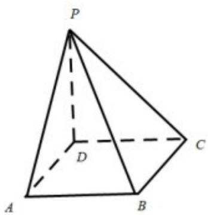

<!-- question-source:start -->
20. 如图，四棱锥 $P - ABCD$ 底面为正方形， $PD \perp$ 底面 $ABCD$ 。设平面 $PAD$ 与平面 $PBC$ 的交线为 $l$ 。

(1) 证明: $l \perp$ 平面 $PDC$ ;

(2) 已知 $PD = AD = 1$ ， $Q$ 为 $l$ 上的点， $QB = \sqrt{2}$ ，求 $PB$ 与平面 $QCD$ 所成角的正弦值.
<!-- question-source:end -->

![[高中/真题/按年份分类/2020/2020年新高考全国卷Ⅱ数学试题_海南卷_含答案/解答题/题目/answers/Q00026473A1.md]]
