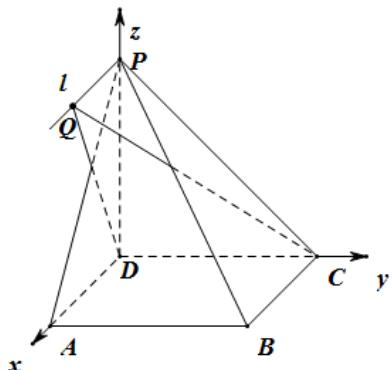

> [!faq]- 2020年新高考全国卷Ⅱ数学试题（海南卷）含答案解析
>
> > [!success]- **【答案】** （1）证明见
>
> > [!note]- **【分析】**
> > (1) 利用线面平行的判定定理以及性质定理，证得 $AD//l$ ，利用线面垂直的判定定理证得 $AD \perp$ 平面
>
> > [!note]- **【解析】**
> > （1）证明：
> >
> > 在正方形 ABCD 中，AD//BC，
> >
> > 因为 $AD \notin$ 平面 PBC， $BC \subset$ 平面 PBC，
> >
> > 所以 $AD / /$ 平面 $PBC$ ，
> >
> > 又因为 $AD \subset$ 平面 PAD，平面 $PAD \cap$ 平面 PBC = l，
> >
> > 所以 AD//l，
> >
> > 因为在四棱锥 P - ABCD 中，底面 ABCD 是正方形，所以 $AD \perp DC, \therefore l \perp DC,$
> >
> > 且 $PD \perp$ 平面 ABCD，所以 $AD \perp PD, \therefore l \perp PD,$
> >
> > 因为 $CD \cap PD = D$
> >
> > 所以 $l \perp$ 平面PDC；
> > (2) 如图建立空间直角坐标系 $D - xyz$ ,因为 $PD = AD = 1$ ，则有 $D(0,0,0),C(0,1,0),A(1,0,0),P(0,0,1),B(1,1,0)$
> >
> > 
> >
> > 设 $Q(m,0,1)$ ，则有 $DC = (0,1,0),DQ = (m,0,1),PB = (1,1, - 1)$
> >
> > 因为 $QB=\sqrt{2}$ ，所以有 $\sqrt{(m-1)^{2}+(0-1)^{2}+(1-0)^{2}}=\sqrt{2}\Rightarrow m=1$
> >
> > 设平面 $QCD$ 的法向量为 $n=(x,y,z)$ ,
> >
> > 则 $\left\{\begin{aligned}DC & \cdot n=0 \\ DQ & \cdot n=0\end{aligned}\right.$ ，即 $\left\{\begin{aligned}y &=0 \\ x + z &=0\end{aligned}\right.$
> >
> > 令 $x = 1$ ，则 $z = -1$ ，所以平面 $QCD$ 的一个法向量为 $n = (1,0, - 1)$ ，则
> >
> > $$
> > \cos <   n, P B > = \frac {n ; P B}{| n | | P B |} = \frac {1 + 0 + 1}{\sqrt {1 ^ {2} + 0 ^ {2} + (- 1) ^ {2}} \cdot \sqrt {1 ^ {2} + 1 ^ {2} + 1 ^ {2}}} = \frac {2}{\sqrt {2} \times \sqrt {3}} = \frac {\sqrt {6}}{3}.
> > $$
> >
> > 根据直线的方向向量与平面法向量所成角的余弦值的绝对值即为直线与平面所成角的正弦值，所以直线与
> >
> > 平面所成角的正弦值等于 $|\cos < n, PB >| = \frac{\sqrt{6}}{3}$
> >
> > 所以直线 $PB$ 与平面 $QCD$ 所成角的正弦值为 $\frac{\sqrt{6}}{3}$
> >
> > 【点睛】该题考查的是有关立体几何的问题，涉及到的知识点有线面平行的判定和性质，线面垂直的判定和性质，利用空间向量求线面角，利用基本不等式求最值，属于中档题目.
