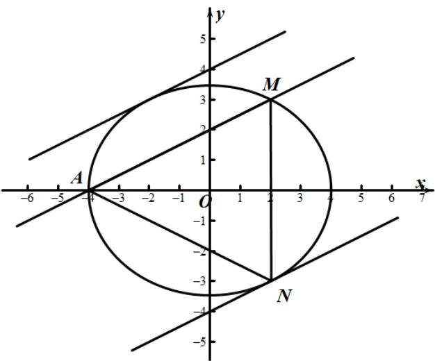

> [!faq]- 2020年新高考全国卷Ⅱ数学试题（海南卷）含答案解析
>
> > [!success]- **【答案】** （1） $\frac{x^{2}}{16}+\frac{y^{2}}{12}=1;$ （2）18. 【
>
> > [!note]- **【分析】**
> > (1)由题意分别求得 $a, b$ 的值即可确定椭圆方程；
> > (2)首先利用几何关系找到三角形面积最大时点 $N$ 的位置，然后联立直线方程与椭圆方程，结合判别式确定点 $N$ 到直线 $AM$ 的距离即可求得三角形面积的最大值.
>
> > [!note]- **【解析】**
> > (1)由题意可知直线AM的方程为： $y - 3 = \frac{1}{2}(x - 2)$ ，即x - 2y = -4.
> >
> > 当 y=0 时，解得 x=-4 ，所以 a=4 ，
> >
> > 椭圆 $C:\frac{x^{2}}{a^{2}}+\frac{y^{2}}{b^{2}}=1(a>b>0)$ 过点 $M(2,3)$ ，可得 $\frac{4}{16}+\frac{9}{b^{2}}=1$ ，
> >
> > 解得 $b^{2}=12$ .
> >
> > 所以 C 的方程： $\frac{x^{2}}{16}+\frac{y^{2}}{12}=1$ .
> > (2)设与直线AM平行的直线方程为： $x - 2y = m$
> >
> > 如图所示，当直线与椭圆相切时，与 $AM$ 距离比较远的直线与椭圆的切点为 $N$ ，此时 $\triangle AMN$ 的面积取得最大值.
> >
> > 
> >
> > 联立直线方程 $x - 2y = m$ 与椭圆方程 $\frac{x^2}{16} +\frac{y^2}{12} = 1$
> >
> > 可得： $3(m+2y)^{2}+4y^{2}=48$
> >
> > 化简可得： $16y^{2}+12my+3m^{2}-48=0$
> >
> > 所以 $\Delta = 144m^{2} - 4 \times 16(3m^{2} - 48) = 0$ ，即 $m^{2} = 64$ ，解得 $m = \pm 8$ ，
> >
> > 与 AM 距离比较远的直线方程：x - 2y = 8，
> >
> > 直线 AM 方程为：x - 2y = -4，
> >
> > 点 $N$ 到直线 $AM$ 的距离即两平行线之间的距离，
> >
> > 利用平行线之间的距离公式可得： $d=\frac{8+4}{\sqrt{1+4}}=\frac{12\sqrt{5}}{5}$ ，
> >
> > 由两点之间距离公式可得 $|AM| = \sqrt{(2 + 4)^2 + 3^2} = 3\sqrt{5}$ .
> >
> > 所以 $\triangle AMN$ 的面积的最大值： $\frac{1}{2}\times3\sqrt{5}\times\frac{12\sqrt{5}}{5}=18$ .
> >
> > 【点睛】解决直线与椭圆的综合问题时，要注意：
> > (1)注意观察应用题设中的每一个条件，明确确定直线、椭圆的条件；
> > (2)强化有关直线与椭圆联立得出一元二次方程后的运算能力，重视根与系数之间的关系、弦长、斜率、三角形的面积等问题.
