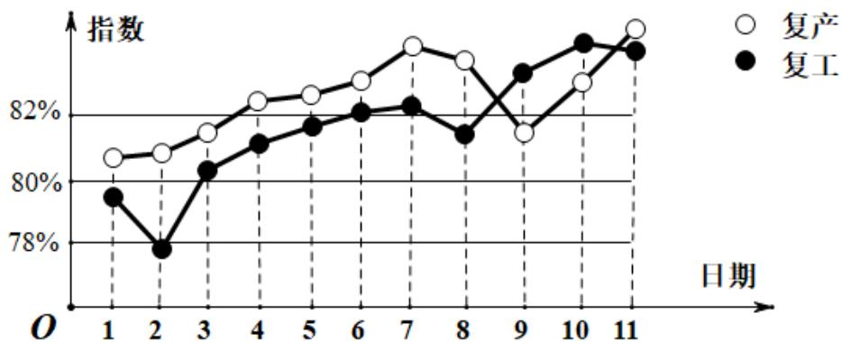

<!-- question-source:start -->
9. 我国新冠肺炎疫情进入常态化，各地有序推进复工复产，下面是某地连续 11 天复工复产指数折线图，下列说法正确的是（）

A. 这 11 天复工指数和复产指数均逐日增加;
B. 这 11 天期间，复产指数增量大于复工指数的增量;
C. 第 3 天至第 11 天复工复产指数均超过 80%;

D. 第 9 天至第 11 天复产指数增量大于复工指数的增量;
<!-- question-source:end -->

![[高中/真题/按年份分类/2020/2020年新高考全国卷Ⅱ数学试题_海南卷_含答案/选择题/题目/answers/Q00026462A1.md]]
